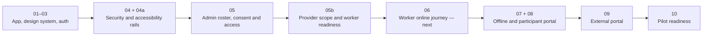

## Product in one sentence

We are building a multi-tenant, mobile-first service-delivery CRM for small-to-medium Australian NDIS providers: office staff prepare safe, service-ready shifts; workers record what was delivered; participants, representatives, and explicitly authorised external people see only the appropriate information.

This is a synthetic-data MVP. It is not yet approved for real participant data or a production pilot.

## Settled first-release boundary

The first release covers:

- invite-only organisations and role-aware accounts;
- provider, participant, worker, roster, consent, authority, and audit foundations;
- one worker, one participant, and one supported individual time-based item per shift;
- a phone-first worker Start → End → participant-readable service-summary journey;
- bounded offline recovery after the online flow is proven;
- participant/representative and consent-backed external portals;
- WCAG 2.2 AA verification and a full synthetic pilot rehearsal.

The first release deliberately excludes billing, NDIS claims, plan-budget tracking, native mobile apps, public signup, chat, shift swaps, GPS/live tracking, service-note photos/audio, specialist/group/multi-item delivery workflows, and full incident case management.

## What is implemented in `main`

| Area | Current capability | Reality check |
| --- | --- | --- |
| Application foundation | Next.js 16, TypeScript, Supabase clients, health route, pnpm toolchain | Implemented and pushed to `origin/main`. |
| Design/accessibility foundation | Tokens, shadcn/ui, trusted tenant-theme fallback, 24px ordinary and 48px worker-control rails, focus-safe sticky layout, axe/Pa11y scripts | Implemented. Real-browser axe and Pa11y now pass; manual assistive-technology evidence remains outstanding. |
| Authentication/onboarding | Invite-only magic-link flow, protected app shell, organisation context selection, founding-tenant bootstrap | Implemented. Production authentication/recovery review and bounded MFA decision remain gates before real data. |
| Data and authorisation | Global identities, memberships/roles, RLS access paths, transactional command RPCs, immutable receipts/events, audit and consent/authority models | Implemented and repeatedly reviewed locally. The complete Ticket 05b path now passes through hosted development Postgres/PostgREST; production remains gated. |
| Admin workspace | Participant, roster, consent, authority, availability, service-context, readiness, identifier and acknowledgement administration | Implemented and validated end-to-end with an isolated synthetic development tenant. |
| Provider/worker readiness | Provider scope, catalogue, screening pathways, competence evidence, immutable service snapshot, service-ready shift creation | Implemented, migration-order repaired, and validated through the complete development browser journey. |
| Worker application | Only a design/demo route exists; no production `/worker` journey | Not implemented. Ticket 06 is next. |
| Offline, participant, representative, external portals | Planned contracts and security foundations only | Not implemented. Tickets 07–09. |
| Pilot release evidence | Partial automated/static evidence | Not complete. Ticket 10 plus human/privacy/security/NDIS review are required. |

## Source-control and verification truth as of 13 August 2026

- Local `main` is clean at `763e8a7` and one commit ahead of `origin/main`. The new checkpoint contains the development migration-order repair, repeatable synthetic browser harness, and accessibility-runner fixes; it has not been pushed.
- Commit `583c955` renamed two migration files into Supabase CLI-compatible timestamp form. Commit `986a534` updated the migration manifest and filename-specific regressions to match those production filenames.
- The forward migration `20260813000001_provider_readiness_ordering_fix.sql` was the only pending development migration and was applied successfully. It repairs the actual lexicographic deployment order, restores the provider-readiness receipt types, retires the reintroduced context-free shift callable, and quarantines snapshot-free history.
- Frozen dependency install, all 12 migration parses, lint, typecheck, production build, `git diff --check`, axe, and Pa11y pass.
- The full isolated database and mounted test suite passes: **16 files, 177/177 tests**. The migration manifest now matches the real Supabase lexical order and fails if the explicit inventory diverges from disk.
- The complete synthetic development journey passes **12/12 steps** through the real UI and PostgREST RPCs, followed by independent remote aggregate verification. Existing organisations were not selected or modified.
- Manual keyboard, zoom/reflow, screen-reader, forced-colour, VoiceOver/TalkBack, and disability-inclusive user validation remain outstanding.
- Production remains unvalidated and prohibited for real participant data.
- No real participant data should be entered.

## Artifact-status reconciliation

The code history and several ticket headers disagree:

- Tickets 04 and 05b, plus several completed remediation tickets, still show `status: 1` even though their approved commits are ancestors of local `main`.
- Ticket 04 retains an explicit production-shaped Postgres/PostgREST gate that was never run, so “implementation integrated” and “all acceptance evidence complete” must not be conflated.
- Ticket 04a and Ticket 05 correctly show complete, while their known manual/browser release checks remain tracked as later pilot gates.

Reconcile statuses only after deciding whether “complete” means implementation merged or every production-shaped verification gate closed. The recommended convention is: close implementation tickets when their scoped merge review passes, and track environment/human release evidence explicitly in Ticket 10 and the production-readiness gate.

## Recommended next steps

1. **Review and push checkpoint `763e8a7`.** The development database already contains its forward migration, so publish the matching repository checkpoint before collaborative Ticket 06 work begins.
2. **Reconcile ticket statuses.** Decide whether ticket completion means scoped implementation merged or every environment/human release gate closed; then update the remaining `status: 1` artifacts consistently.
3. **Implement Ticket 06.** Build the real phone-first online worker journey: today list, shift detail, optional On my way, Start, End, text summary, server acceptance/conflict, and urgent-help handoff.
4. **Continue the pilot path.** After Ticket 06, Tickets 07 (bounded offline) and 08 (participant/representative portal) may proceed as separate workstreams; then Ticket 09 (external portal), followed by Ticket 10 (full synthetic pilot/accessibility/readiness evidence).

## Workspace cleanup completed

- Kevin approved all five named worktrees individually. After `main` was pushed, Traycer reclassified the four ticket worktrees as **Landed**; the fifth remained **Orphaned**. All five were removed through `traycer worktree delete`.
- Traycer now reports **zero managed worktrees**. The main checkout at `/Users/kevinmalana/Documents/traycer` is the only Git worktree.
- Completed specialist, builder, and reviewer chats were archived. The active working set is this Project Manager plus one reusable Coder, rebound to the main workspace.
- The four historical ticket branch refs remain locally as merged references; their worktrees are gone and all commits are reachable from `main` and `origin/main`.

## Review order

1. Read the [Epic Brief](../../ndis-provider-crm-brief/index.md) for the product and privacy boundary.
2. Read this artifact's verification truth before trusting older “all green” summaries.
3. Read the [development synthetic journey validation](../../reviews/synthetic-admin-provider-readiness-validation/index.md) for the Ticket 06 prerequisite evidence and migration-order repair.
4. Review [Ticket 06](../../tickets/06-worker-online-shift-and-service-summary/index.md) as the next product slice.
5. Use the older [Tickets 01–05b walkthrough](../tickets-01-through-05b-synthetic-admin-mvp/index.md) for implementation detail, but treat its pre-merge and verification statements as historical where this artifact supersedes them.
