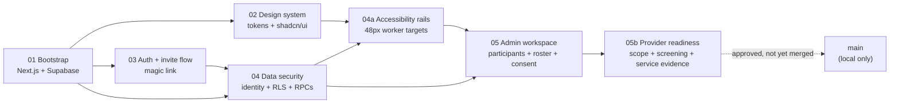

## What shipped

A multi-tenant SaaS CRM scaffold for small-to-medium Australian NDIS providers, hardened through eight rounds of independent review, ready for the first no-SQL admin journey on synthetic data. The merge chain is:



Total surface area: 85 files changed, 24,940 insertions, 1,453 deletions on `main`; one additional 2,235-line branch `traycer/ticket-05b-provider-readiness` waiting at commit `8848c77` for the merge step you approved.

## What you can test now (admin)

The first end-to-end browser journey Kevin runs is the **10-step readiness workflow** inside `/app/admin`. Every step is a real UI form backed by a transactional Supabase RPC — no SQL editing, no service-key leakage, no client-side table writes.

| # | Step | What it proves |
| --- | --- | --- |
| 1 | Sign in at `/sign-in` (magic link to a synthetic email) | Auth + session + organisation shell |
| 2 | Configure provider scope (registered/unregistered, group, class, jurisdictions, reviewer) | Effective dated scope versioning |
| 3 | Add a time-based support capability + catalogue item | Service-kind + unit locked to `individual_time_supported` |
| 4 | Define a risk-assessed role + screening policy (registered/unregistered decision) | Strictest-rule screening |
| 5 | Verify a synthetic worker (source, verifier, clearance expiry, adverse flags) | Adverse screening never silently clears |
| 6 | Record a named pathway (work experience, working on application, placement, contractor) with full evidence | No generic override |
| 7 | Add a competence requirement and `met` evidence with controlled expiry | Competence hard-block at schedule time |
| 8 | Set the participant's NDIS number (masked for everyone; admin-only audited full-reveal) | Sensitive identifier gating |
| 9 | Create a participant service context (capability + item + agreement/plan + goal), have a reviewer mark it `active` | Only reviewed active contexts schedule work |
| 10 | Create the service-ready shift and inspect the immutable snapshot | Readiness re-evaluated at Start |

The same workspace also lets a scheduler (not admin) accept invites, record worker availability, and read admin-only records without permission errors — admin-only RPCs are role-gated in the UI, server RPCs enforce authority as the second guard.

After Ticket 05b lands, every admin action is:

- Idempotent on retry (same command ID returns the original receipt even if mutable state changed).
- Tenant-scoped (no cross-organisation writes).
- Audit-logged with a single append-only row per action.
- Locked under a per-organisation advisory lock during readiness evaluation, so a concurrent revocation cannot slip through.

## What the database is doing underneath

Eight migrations plus the readiness migration live on `main` and the 05b branch. They collectively enforce:

- Multi-tenant identity (`global_profiles` + `organisation_memberships` + role rows — one user can belong to many providers; roles are stored separately from the base membership).
- Per-row access via RLS, not just UI hiding — admin/scheduler reads, assigned-worker reads, participant self-link reads, representative-authority reads (effective at event time, scoped), external-grant reads (current, in-window, scoped).
- Transactional command RPCs for every sensitive action. No browser path can `INSERT`/`UPDATE`/`DELETE` on participant, shift, evidence, acknowledgement, or receipt tables directly; the only write path is a typed RPC wrapper.
- Immutable evidence. `shift_service_snapshots` and the acknowledgement ledger reject UPDATE/DELETE except via the locked successor path; corrections are explicit successors with a reason, never silent overwrites.
- Soft-delete with a separate audit trail. Nothing is hard-deleted automatically; the prior 30-day purge promise was retracted pending qualified review.

The migration names on each branch:

| Branch | Migrations | Total LoC |
| --- | --- | --- |
| `main` | `0001`–`0008`, `0008b`, `0008c` | ~7,200 lines |
| `traycer/ticket-05b-provider-readiness` | adds `0009` | +985 lines |

## Review order

When you (or a future reviewer) want to inspect this change, the order below surfaces the load-bearing decisions first:

1. **Product contract** — [Ticket 05b ticket artifact](/Users/kevinmalana/.traycer/epics/d2224b09-58de-43fc-b758-76653d2a5742/artifacts/tickets/05b-provider-scope-worker-compliance-service-evidence/index.md). Read the goal, product boundary, security contract, and required verification sections. Everything else either implements or regresses against this.
2. **Database foundation** — `supabase/migrations/0009_provider_readiness_service_evidence.sql` (985 lines, one file). The retirement of the old 8-arg `cmd_admin_create_shift`, the new service-ready command, the readiness predicate, the acknowledgement lineage, the immutable guards, the locks, and the named-pathway enforcement all live here. Read this top-to-bottom before opening any UI file.
3. **Admin surface** — `src/app/app/admin/workspace-client.tsx` (~1,500 lines). This is where every form, every role gate, every retry fingerprint, and every acknowledgement/correction interaction lives. The mounted tests in `tests/admin-workspace-mounted.test.tsx` exercise the real React behaviour, not just helpers.
4. **Final independent reviews** —
  - [Final DB/security review](/Users/kevinmalana/.traycer/epics/d2224b09-58de-43fc-b758-76653d2a5742/artifacts/tickets/05b-provider-scope-worker-compliance-service-evidence/review/final-db-security/index.md)
  - [Final product/UI review](/Users/kevinmalana/.traycer/epics/d2224b09-58de-43fc-b758-76653d2a5742/artifacts/tickets/05b-provider-scope-worker-compliance-service-evidence/review/final-product-ui/index.md)
  - [Final fixup review](/Users/kevinmalana/.traycer/epics/d2224b09-58de-43fc-b758-76653d2a5742/artifacts/tickets/05b-provider-scope-worker-compliance-service-evidence/review/final-fixup/index.md)
  - [Final UI fixup verification](/Users/kevinmalana/.traycer/epics/d2224b09-58de-43fc-b758-76653d2a5742/artifacts/tickets/05b-provider-scope-worker-compliance-service-evidence/review/final-ui-fixup-verification/index.md)
 These four artifacts are the cumulative record of every P0/P1 the independent reviewers reproduced and what closed them.

## Important decisions baked in

These are the load-bearing product calls that future agents and reviewers need to know are settled, with citations:

- **All provider types may onboard, but only individual time-based services are supported in v1.** SIL, SDA, high-intensity, behaviour support and restrictive practices are explicitly `specialist_phased` or `not_supported`. Recorded in the [revised MVP 1 requirements](/Users/kevinmalana/.traycer/epics/d2224b09-58de-43fc-b758-76653d2a5742/artifacts/mvp1-revised-requirements-critique/index.md).
- **No generic screening override.** Only the named official pathways (work experience, working on application, higher-education placement, contractor) are accepted; each pathway requires its own evidence shape and a currently cleared, distinct supervisor. [NDIS worker screening guidance](https://www.ndiscommission.gov.au/workforce/worker-screening/worker-screening-registered-providers).
- **Required competence evidence is a hard gate.** No single-shift admin override.
- **NDIS number is office-only, masked, with admin-only audited reveal.** No worker, portal, or analytics projection.
- **Service summary is participant-readable, no photos, text only.** Acknowledgement is recorded by office staff as provider-recorded external evidence; it never claims participant-authenticated action. Participant-authenticated acknowledgement arrives with Ticket 08.
- **Start re-evaluates readiness at action time.** A revocation after accepted Start preserves events/receipts and routes the shift to `urgent_provider_review` rather than deleting evidence.
- **One immutable conclusive acknowledgement chain per service record.** Exactly one root, at most one accepted successor per current leaf. Corrections supply the expected current event + reason + evidence; competing corrections are quarantined.
- **MFA for administrators remains deferred to first paying customer / 90 days post-pilot go-live**, with the explicit phishing and shared-inbox risk recorded in the decision log.
- **Magic-link auto-failover to local hashed-token test callback** (commit `229820b`) was added for local testing after Supabase's email rate limit was hit. Production auth flow uses the standard magic-link exchange.

## Gotchas — where the obvious shape is not what shipped

- **`middleware.ts` is named `proxy.ts`.** Next.js 16 renamed the middleware entrypoint and the function name. The matcher convention is unchanged. If you read older Next.js docs you will not find this file by the old name.
- **`SUPABASE_SERVICE_ROLE_KEY` and `NEXT_PUBLIC_*` keys are intentionally separated.** The private server key is loaded only by server components and the bootstrap script; the browser bundle has been audited to contain no reference to it. A past bug imported the server key in a client component, causing a confusing "key not set" error in the browser. That bug is closed and tested.
- **PostgreSQL function overloading is the reason the old `cmd_admin_create_shift(text, uuid, uuid, uuid, timestamptz, timestamptz, text, jsonb)` is dangerous.** Changing the argument list creates a new overload instead of replacing the old one. The 0009 migration explicitly `DROP FUNCTION`s the old signature before creating the new service-ready command.
- **Pre-`0009` context-free shifts become `legacy_incomplete`.** They are visible to admins as history but cannot be copied, started, reassigned as ready, summarised, or projected to the worker route. They will never be ticket-06-actionable. This is by design, not a regression to investigate.
- **The 30-day automatic hard-purge promise in the original Ticket 03 was retracted.** Soft-delete with 30-day recovery remains. Hard-purge is paused until qualified privacy/security review approves a per-category retention schedule.
- **PGlite is a single-connection harness.** True two-session race conditions cannot be reproduced locally. The production-shaped substitute is (a) catalogue inspection of the installed `BEFORE INSERT OR DELETE OR UPDATE` lock trigger/function, plus (b) single-session transaction reproductions that prove the advisory `ExclusiveLock` is held. The reviewer explicitly accepted this constraint.
- **The test harness `tests/db/harness.ts` grants blanket CRUD on every public table to a `test_auth_user` role** so the historical suite can run. This would mask real `authenticated`-role ACL bugs. The 05b fixup added targeted catalog-privilege tests that revoke the blanket grant and exercise the real authenticated role. Read the comment at `tests/db/harness.ts:99-107` before assuming a green test means the production role can do the same thing.
- **Chromium/Chrome is not installed in this environment.** Axe-core, Pa11y, and the Playwright-mounted browser tests are blocked. The static + mounted `happy-dom` tests prove component behaviour but do not substitute for a real assistive-technology / keyboard / 320px / 200%-zoom pass. The pre-merge review recorded this honestly as an unclosed gate.

## Verification status

| Check | Result |
| --- | --- |
| Full DB / RPC / mounted test suite | 176/176 pass on `8848c77` |
| Migration parsing (0001–0009) | Pass |
| `pnpm lint` / `pnpm typecheck` / `pnpm build` | Pass |
| `git diff --check` against the prior frozen commit | Pass |
| Real PostgreSQL / PostgREST / Supabase remote gate | **Not run** — intentionally skipped per your direction |
| Authenticated browser / mobile / keyboard / zoom / AT | **Not run** — no browser available |
| Remote Supabase migrations | **Not applied** — your `.env.local` keys were rotated; you have not asked to apply |

The five DB P0/P1 and the three UI P1 from the prior reviews were each closed by direct, de-confounded PGlite probe or mounted DOM probe. The full closure map is in the [final UI fixup verification artifact](/Users/kevinmalana/.traycer/epics/d2224b09-58de-43fc-b758-76653d2a5742/artifacts/tickets/05b-provider-scope-worker-compliance-service-evidence/review/final-ui-fixup-verification/index.md).

## What is still deferred (Tickets 06 → 10)

The MVP is now an admin-only foundation. Tickets 06–10 are not yet started:

| Ticket | What it adds | What you can test then |
| --- | --- | --- |
| **06 — Worker online shift + service summary** | Mobile-first `/worker` flow: today list, shift detail, Start/End, text summary, urgent-help route. Consumes only `cmd_admin_create_service_ready_shift` output. | A worker (separate test account) completes a synthetic shift end-to-end on the browser. |
| **07 — Bounded offline worker** | Serwist service worker, Dexie IndexedDB queue, foreground reconnect sync, approved device enrolment, 24-hour maximum offline window. | A worker completes a shift through a dropped connection; evidence is preserved on reconnect. |
| **08 — Participant / nominee portal** | Magic-link sign-in, upcoming visits, post-visit service summaries, contact preferences, request correction. | A participant (separate test account) views their service history and requests a correction. |
| **09 — External grant portal** | Time-limited external disclosure with recorded purpose / categories / recipient / expiry. | An external coordinator accesses a specific participant summary under a granted, in-window consent. |
| **10 — Pilot accessibility + test readiness** | Full accessibility audit pass, scenario-based pilot testing, documentation gate. | Pilot launch. |

Several things are explicitly **out of scope** for the v1 pilot and recorded in the decision log:

- Native iOS / Android apps (PWA only).
- Billing, invoicing, NDIS claims (manual export for v1).
- Audio notes, Auslan/BSL video, real-time participant in-transit.
- MFA for administrators (until first paying customer + 90 days post-pilot).
- In-app messaging, shift-swap marketplace, public sign-up.
- Hard purge / automatic data destruction (paused until qualified retention review).

## How to actually run what is merged

If you want to test what is on `main` today:

```bash
cd /Users/kevinmalana/Documents/traycer/ndis-provider-crm
pnpm dev
```

Then open in your browser:

- [http://localhost:3000](http://localhost:3000) — landing page
- [http://localhost:3000/demo/today-list](http://localhost:3000/demo/today-list) — interactive worker preview (still no DB)
- [http://localhost:3000/design-system](http://localhost:3000/design-system) — dev-only token + component reference
- [http://localhost:3000/sign-in](http://localhost:3000/sign-in) — magic-link sign-in (requires the Supabase env vars)
- [http://localhost:3000/app](http://localhost:3000/app) — protected admin shell (after sign-in)

The `8848c77` Ticket 05b branch is at `/Users/kevinmalana/.traycer/worktrees/kevinmalana__ndis-provider-crm/traycer-ticket-05b-provider-readiness`. To test the admin journey with synthetic data, you need to:

1. Merge `8848c77` into `main` (the merge step you already approved).
2. Apply migrations `0001` through `0009` to your Supabase project via `pnpm dlx supabase db push` (after `supabase login`).
3. Add `FOUNDING_ORG_NAME=Open NDIS` and `FOUNDING_ADMIN_EMAIL=your-test-email@…` to `.env.local` if not already there.
4. Run `pnpm bootstrap` to print a one-time invitation URL; open it, accept the magic link, and you are the founding admin.

You can then walk the 10-step readiness journey above. Every step is a UI form backed by a typed RPC. The data is synthetic.
