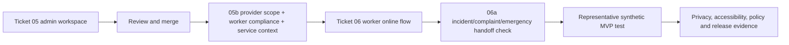

## Review boundary

Cold gap audit of the revised brief, technical plan, user stories, worker flow, and Tickets 05–10 against current official NDIS Commission, NDIS, and OAIC material as at 10 August 2026. This is product and engineering research, not legal advice or a claim of compliance. Requirements differ by provider registration status, registration group, support type, jurisdiction, and participant circumstances.

## Executive finding

The current plan is strong on tenancy isolation, distinct authority models, evidence-preserving shift commands, participant-readable summaries, and accessibility rails. The first MVP still lacks several ordinary provider-operating records that determine whether the CRM can support a real pilot: provider regulatory scope, worker suitability/competence, complete service-delivery evidence, and configured handoffs into incident, complaint, emergency, and privacy processes.

Do not expand Ticket 06 into a full compliance suite. Add the minimum cross-cutting records and handoff contracts before calling the synthetic loop representative, then keep specialist modules explicitly unsupported until separately designed.

## Priority findings

| Priority | Gap | What breaks first | Minimum MVP correction | Suggested home |
| --- | --- | --- | --- | --- |
| P0 | Provider scope is undefined | The product cannot know which Practice Standards modules or screening, service-agreement, behaviour-support, SIL, personal-support, or jurisdictional rules apply. A generic “NDIS compliant CRM” claim would be unsafe. | Record registered/unregistered status, registration groups/support categories, operating jurisdictions, and explicitly supported/unsupported modules. Show the active scope in admin settings and release evidence. | New `05b` scope/readiness ticket; Ticket 10 gate |
| P0 | Worker screening and competence records are absent | An admin can invite and roster a worker without recording whether the role is risk-assessed, the clearance status/expiry, exceptions/supervision, qualifications, induction, training, or suitability. | Add risk-assessed role classification; screening status/reference/expiry and verification time; exception/supervision record; required qualification/training matrix; warning/block policy owned by the provider. Preserve historical records after unlinking. | `05b` before representative roster testing |
| P0 | Shift/summary records are not complete NDIS delivery evidence | The current participant model has no NDIS number, service agreement, support type/item, goal linkage, quantity/hours field, or participant/nominee support-log acknowledgement. A finalised summary alone may not support payment assurance or an audit. | Add participant NDIS identifier with restricted display; service agreement/support-plan reference and effective period; shift support type/item and goal; actual duration derived from accepted Start/End; optional progress/future-plan fields; explicit acknowledgement/signature status where the provider uses support logs. Keep invoicing and claiming out of scope. | Amend 05 data setup + 06 service-summary contract before representative test |
| P0 | Incident and complaint handoffs are not operationally complete | “Urgent concern” can show a phone number, but the plan does not guarantee the provider's incident system, responsible person, timestamped handoff, acknowledgement, or reportable-deadline escalation. Complaints/advocacy routes are absent. | Configure provider incident and complaint contacts/URLs, responsible role, fallback phone, and external NDIS Commission/advocacy information. Record that a handoff was initiated and acknowledged without storing a full incident in the service summary. Display provider-owned 24-hour/5-business-day escalation guidance for registered-provider reportable incidents. | 06 urgent route + Ticket 10 operational gate; full case management remains out |
| P1 | Emergency/disaster and continuity records are too thin | A critical-information card does not establish participant-specific continuity arrangements, worker responsibilities, communication contacts, or plan review/testing. | Add an external plan reference, participant-specific continuity summary, priority/critical-support flag, contacts, reviewed/review-due dates, and worker acknowledgement. Do not attempt a full emergency-management product in MVP 1. | 05 participant setup + 06 detail; Ticket 10 rehearsal |
| P1 | Privacy notice, consent lifecycle, access/correction handling, and breach response are only partly productised | Authority/grant evidence is strong, but the participant is not shown a versioned collection/use/retention notice or communication format; access/correction requests lack policy deadlines, refusal reasons, alternative access, and external complaint path; breach response lives only in prose. | Version the privacy/collection notice and consent evidence; capture preferred accessible communication; add request owner/due date/status/outcome/refusal reason and “no wrong door” intake; link the operator breach runbook and session/access revocation action. Do not hard-code a universal legal result. | 05/08 request metadata + Ticket 10 runbook gate |
| P1 | Communication, culture, preferences, and supported decision-making are not first-class | Workers may receive a critical text card without knowing the participant's preferred language/mode, communication aid, supported-decision arrangement, relevant cultural preferences, or who may assist. | Add minimised, participant-directed communication and support preferences with source, consent, review date, and worker visibility. Avoid broad free-text medical profiling. | 05 participant profile + 06 critical handoff |
| P1 | Specialist/high-risk supports are not explicitly excluded in the UI | A provider could record restrictive-practice, high-intensity, SIL, or personal-support activity in generic notes even though the product has no authorisation, plan, reporting, supervision, or module-specific controls. | Make unsupported support categories explicit and prevent the CRM from presenting generic service summaries as sufficient specialist-module records. Add specialist modules only through separate planning. | Provider-scope gate and admin copy |
| P2 | Quality, audit, and evidence extraction remain manual | The data is append-only, but a provider cannot yet assemble a readable participant record, worker screening register, service-delivery evidence pack, or audit sample. | Define bounded, role-gated exports/reports with redaction and audit logging after the underlying records settle. Do not add broad bulk export by default. | Ticket 10 or post-MVP reporting ticket |

## Official evidence behind the findings

### Provider scope is load-bearing

The NDIS Practice Standards use different core, verification, and supplementary modules depending on the supports delivered. The CRM therefore needs an explicit provider scope before it can decide which workflows are supported or make readiness claims. [NDIS Practice Standards](https://www.ndiscommission.gov.au/rules-and-standards/ndis-practice-standards)

### Worker records are more than an invitation and role

Registered providers must identify risk-assessed roles and keep worker screening records that remain organised, accessible, and legible after unlinking; the Commission guidance specifies a seven-year period and fields including clearance/reference/expiry and exception or supervision information. The Practice Standards also call for records of pre-employment checks, qualifications, induction, training, competence, and role limitations. [Worker screening for registered providers](https://www.ndiscommission.gov.au/workforce/worker-screening/worker-screening-registered-providers), [provider governance and human-resource indicators](https://www.ndiscommission.gov.au/rules-and-standards/ndis-practice-standards/core-module-provider-governance-and-operational)

### Service records need support context

Current NDIS guidance says provider records should be complete and accurate and include participant identity/NDIS number, delivery dates, quantity or hours, and support type. It describes case notes as relating activities to a support item and participant goals, and says support logs are signed by the participant or an authorised representative. Service agreements describe what will be delivered and how. [NDIS record-keeping requirements](https://www.ndis.gov.au/providers/working-provider/reporting-and-recording-keeping/what-are-record-keeping-requirements), [Practice Standards—provision of supports](https://www.ndiscommission.gov.au/rules-and-standards/ndis-practice-standards/core-module-provision-supports)

### Incident, complaint, and emergency paths must connect to real processes

Registered providers must maintain incident and complaint systems. Official incident guidance requires identification, recording, privacy-preserving storage, internal reporting, responsible personnel, and escalation; reportable incidents commonly have 24-hour or five-business-day Commission timeframes. Complaints information must be accessible and include provider, external Commission, and advocacy avenues. Emergency/disaster indicators require participant-informed plans, continuity of critical supports, communication, worker training, testing, and review. [Incident management](https://www.ndiscommission.gov.au/rules-and-standards/reportable-incidents-and-incident-management/incident-management), [reportable incidents](https://www.ndiscommission.gov.au/rules-and-standards/reportable-incidents-and-incident-management/reportable-incidents), [complaints guidance](https://www.ndiscommission.gov.au/complaints/complaints-about-supports-and-services-you-provide), [provider governance and emergency-management indicators](https://www.ndiscommission.gov.au/rules-and-standards/ndis-practice-standards/core-module-provider-governance-and-operational)

### Privacy obligations require operational handling, not only RLS

The Practice Standards expect participants to understand collection, use, storage, access, correction, and consent withdrawal. OAIC guidance says organisations should generally respond to access and correction requests within a reasonable period that usually does not exceed 30 days, while allowing context-specific handling; APP 11 calls for layered technical and organisational safeguards across the information lifecycle. The NDB response model covers containment, assessment, notification where required, and review. [Practice Standards—information management](https://www.ndiscommission.gov.au/rules-and-standards/ndis-practice-standards/core-module-provider-governance-and-operational), [OAIC APP 12](https://www.oaic.gov.au/privacy/australian-privacy-principles/australian-privacy-principles-guidelines/chapter-12-app-12-access-to-personal-information), [OAIC APP 13](https://www.oaic.gov.au/privacy/australian-privacy-principles/australian-privacy-principles-guidelines/chapter-13-app-13-correction-of-personal-information), [OAIC APP 11](https://www.oaic.gov.au/privacy/australian-privacy-principles/australian-privacy-principles-guidelines/chapter-11-app-11-security-of-personal-information), [OAIC breach-response guide](https://www.oaic.gov.au/privacy/notifiable-data-breaches/quick-reference-guide-for-responding-to-data-breaches)

### Specialist modules must not be implied by generic notes

Restrictive-practice implementing providers have authorisation, behaviour-support-plan, incident, written-record, and monthly reporting obligations that the generic shift/summary flow does not implement. Similar module-specific rules apply to other high-risk supports. [Rules for implementing providers](https://www.ndiscommission.gov.au/rules-and-standards/behaviour-support-and-restrictive-practices/rules-implementing-providers)

## What is already strong

- Tenant isolation, membership/grant separation, and exact authority windows are more careful than a typical early CRM.
- The Start → End → summary lifecycle preserves actual service time and prevents note-writing time from inflating delivery time.
- Idempotent RPC commands, immutable correction versions, and conflict preservation are suitable foundations for trustworthy records.
- Participant-readable final summaries and external grant scoping address transparency and disclosure boundaries.
- Ticket 04a's 48 CSS-pixel worker controls, focus-safe sticky layout, forced-colour/reduced-motion rails, and strict automated checks provide a sound accessibility base.

## Recommended sequencing

Do not restart Tickets 04/04a. Review Ticket 05 as built, then decide whether the P0 service-context and worker-compliance fields enter a narrow `05b` before Ticket 06 or are deliberately deferred behind an explicit “not for real provider use” banner. The safer recommendation is `05b` before 06 because the worker flow otherwise finalises records that are structurally incomplete for common provider evidence needs.
