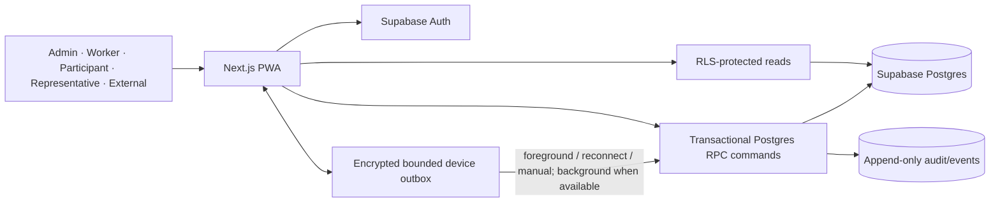
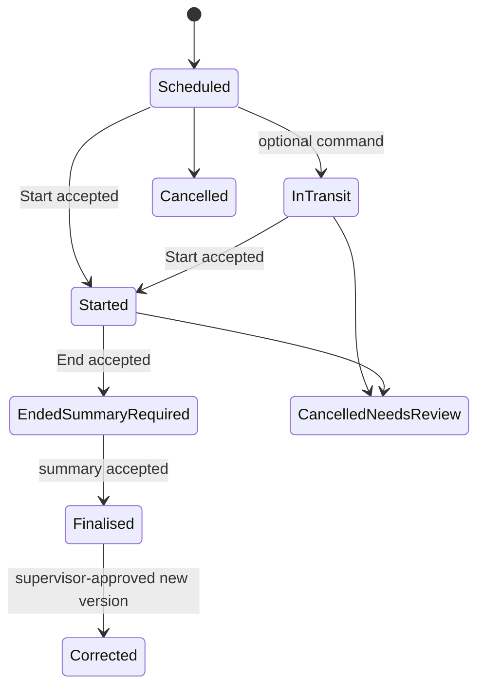
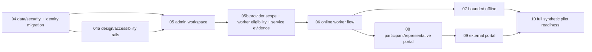

## Revision note

This plan replaces the earlier technical plan after two independent critiques and the 2026-08-06 `traycer-revise-requirements` discussion with Kevin. The working Next.js/Supabase/auth/design-system foundation remains useful, but its single-organisation profile model is superseded and requires a forward migration before participant, roster, portal, or offline implementation.

The MVP target is the **full v1 pilot scope**, delivered in staged, synthetic-data-only releases. No real participant information enters the system until the privacy/security/NDIS production gates are completed.

## Decision summary

- **Application:** Next.js App Router + TypeScript PWA on Vercel; Supabase Auth/Postgres/RLS/Storage/Realtime in Sydney.
- **Identity:** one global authenticated account; separate active organisation memberships and roles; separate participant self-links, representative authority, and consent-backed external grants.
- **Writes:** ordinary authorised reads use Supabase RLS directly. Sensitive state changes call narrowly scoped **Postgres RPC functions directly through Supabase**—no separate API service for the MVP.
- **Worker evidence:** optional On my way; separate Start and End; participant-readable summary after End; idempotent commands; immutable correction versions; rejected/conflicting evidence preserved for review.
- **Offline:** approved individually enrolled devices only; minimum current-day assigned data; maximum 24 hours since online permission verification; foreground/app-open/reconnect/manual retry is guaranteed, Background Sync is optional enhancement.
- **Retention:** soft-delete remains. No automatic 30-day hard-purge worker until a qualified per-data-category retention, legal-hold, destruction/de-identification, and audit policy is approved.
- **Authentication:** magic-link-only remains for the synthetic MVP and under the existing bounded deferral chosen by Kevin. The plan makes no claim that magic links remove phishing. Account-recovery and authentication threat review are required before real-data use; the bounded MFA decision must be revisited at the first paying customer or 90 days after pilot go-live, whichever comes first.
- **Accessibility:** WCAG 2.2 AA across every role/state; 48 CSS-pixel minimum worker controls; automated checks plus manual assistive-technology and disability-inclusive validation.
- **Provider/evidence boundary:** all provider types may create an organisation account, but this is not broad workflow coverage. Ticket 06 supports only one-worker/one-participant individual time-based services with one item per shift. Provider-owned scope is enforced inside that product boundary; specialist, group, multi-item, transport/activity-quantity and billing workflows remain phased or unsupported. Assignments require current provider-recorded screening/pathway and role-competence evidence, and every new shift carries one immutable reviewed service-context snapshot.

## Architecture

### Why Supabase RPC rather than raw table writes

The client still talks directly to Supabase, preserving MVP simplicity. Each sensitive RPC validates authority and current version, applies one transition, records client-reported and server-receipt times, stores an idempotency receipt, and appends audit data in one transaction. A retry with the same command ID returns the original outcome. Raw multi-table writes cannot safely promise this across offline retries, cancellation, reassignment, and corrections.

## Identity and authorisation model

The current `profiles(id, organisation_id, role)` table cannot represent a worker, participant, representative, or coordinator involved with more than one provider. Replace that assumption before domain data lands.

| Concept | Responsibility |
| --- | --- |
| Global user profile | Display identity tied one-to-one to `auth.users`; contains no authoritative organisation or role. |
| Organisation membership | Links a global user to one provider with status and effective dates. Roles are attached per membership and may differ across providers. |
| Active organisation context | An explicit UI/session choice used for navigation and request scoping. It is never trusted as authorisation by itself. |
| Participant self-link | Links a participant record to the participant's authenticated account for their own portal. It is not an optional external grant. |
| Representative authority | Records representative account, relationship/authority type, evidence reference, scope, issuer, effective/expiry dates, and amendment/withdrawal history. |
| Internal work access | Derived from active membership, role, assignment, and record classification. It is not represented as participant-granted optional access. |
| External disclosure grant | Purpose-specific, recipient-specific, category-scoped and time-bounded; backed by current participant or authorised-representative consent evidence. |

RLS checks the row's `organisation_id` plus the relevant active membership, participant self-link, representative authority, assignment, or external grant. It does not derive authority from mutable user metadata or an active-organisation value sent by the browser. Cross-provider accounts explicitly select context, and every sensitive page displays it.

### Forward migration

Add a new migration before ticket 05:

1. Create global user profiles, organisation memberships, membership roles, and the separate participant/representative/external relationships.
2. Migrate each existing `profiles` row into one global profile plus one membership/role without changing the `auth.users` identity.
3. Update invitations so acceptance creates or extends a membership instead of attempting a second global profile.
4. Preserve existing invitation and audit identifiers/history.
5. Replace single-organisation helper functions and RLS policies with membership/grant checks; add positive and negative access-matrix tests.
6. Update the protected app shell to require an active membership/context. Do not delete the legacy columns until all callers and rollback checks are complete.

## Provider scope, worker eligibility, and service-evidence foundation

Ticket 05b is corrective integration between completed Ticket 05 and Ticket 06. The product-supported unit is deliberately narrow: one worker, one participant and one individual time-based support item per shift. Group attendance/ratios, multiple item segments, transport/activity quantities, billing rounding and specialist modules remain unavailable even when that provider can onboard.

### Migration and Ticket 05 integration

- Transactional migration `0009` applies after Ticket 05 migration `0008` and preserves identities, participants, shifts, assignments, receipts, summaries and audit history.
- Explicitly drop the eight-argument `cmd_admin_create_shift(text, uuid, uuid, uuid, timestamptz, timestamptz, text, jsonb)` signature. PostgreSQL overloads changed signatures, so adding parameters without dropping it is forbidden.
- Add `cmd_admin_create_service_ready_shift`, update the Ticket 05 admin page, typed wrappers and database types to use it, and update reassignment and Start enforcement. An old-signature call must fail rather than warn or infer a default context.
- Mark pre-0009 context-free shifts `legacy_incomplete`. Admins retain read-only history, but those rows cannot be copied forward, started, finalised or projected to Ticket 06 as actionable.
- Migration is forward-only and atomic: a failed upgrade leaves the 0008 schema/data intact. Verification applies 0001→0009 fresh and 0001→0008 populated→0009, and checks the old function is absent from the callable catalog.

### Provider scope and catalogue contract

Use explicit organisation-scoped immutable/versioned relations:

- `organisation_provider_scope_versions`: registered/unregistered declaration, registration-group/class-of-support references, operating jurisdictions, effective window, status, author/reviewer and supersession.
- `organisation_support_capabilities`: scope-version link, support category/class, service kind, effective window and provider-owned capability `individual_time_supported`, `specialist_phased` or `not_supported`.
- `provider_support_catalogue_versions` and `provider_support_items`: organisation, source label/version, item code/name/category, unit, service kind, effective window and supersession state. This is a provider-managed snapshot, not a live NDIA integration or legal applicability engine.

Only an active/current capability row with `individual_time_supported` and an `hour`/time unit is eligible. The service-context and scheduled window must match its organisation, jurisdiction, category/item and effective period. Provider configuration cannot promote a product-unsupported service kind.

### Worker readiness contract

Use versioned `risk_assessed_role_versions`, `role_competence_requirements`, `worker_screening_verification_versions`, `worker_screening_pathway_versions`, and `worker_competence_evidence_versions`.

- Risk-role versions record title, rule-definition basis, description, assessor/title and assessment date.
- `role_screening_policy_versions` records the provider role, registered/unregistered state at decision time, `required`/`not_required`, owner, reason, effective window and supersession. Registered risk-assessed roles are required regardless of a contradictory provider value. Registered non-risk roles use the not-required registration baseline unless an effective provider policy requires more. Every unregistered-provider role needs an explicit effective provider decision before readiness can be computed.
- A service-context version may add `screening_required_by_participant` with decision issuer/authority, evidence reference and effective window; it can make screening stricter but cannot relax a registered/provider requirement. The server predicate is `registered_and_risk_assessed OR provider_required OR participant_context_required`.
- Clearance records include source checked, verifier/time, application/check reference, status/expiry and interim bar, suspension, exclusion or revocation state.
- Screening pathways are an enum, not free text: `secondary_school_work_experience`, `working_on_application`, `higher_education_placement`, or `contractor_administered`. Work experience/working on application are modelled as no-clearance exceptions only where their required conditions apply; placement/contractor records instead require evidence of the external screening/contract administration. Each pathway enforces its relevant jurisdiction, application/placement/contract reference, start/end, cleared supervisor, risk-management plan and external administering-organisation fields. Unsupported bases block assignment.
- Role/support competence requirements define evidence type, required/not-required state, assessment method, review owner and effective window. Evidence records carry issuer/reference, verifier, assessed status, limitations and expiry. Every required item must be `met` and current; there is no per-shift competence override.
- Provider admins version future scope/role policy. Schedulers may roster only against the resulting readiness projection; neither role may convert missing evidence into a one-off green result.
- Missing policy for an unregistered-provider role is `not_ready`, never an inferred `not_required`. Any recorded interim bar, suspension, exclusion or revocation is an unconditional block even when the computed requirement would otherwise be false. Provider-required competence remains an independent hard gate.

Create/reassign locks and validates membership, scope, capability, catalogue item, service context, screening pathway/clearance and competence for the complete scheduled Start→End interval in one transaction. Start rechecks current readiness. If revocation arrives after accepted Start, preserve every event/receipt and route the shift to urgent provider review rather than erasing it or claiming normal completion.

### Service context, identifier and snapshot contract

- `participant_ndis_identifiers` is separate from `participants`; direct worker/participant/representative/external reads are denied. Admins and schedulers use a masked projection. `cmd_admin_reveal_participant_ndis_identifier` requires an active admin membership, a non-empty purpose/reason and an audit event; the full value never enters worker/portal/cache/analytics projections.
- `participant_service_context_versions` links one participant, one current support-capability row and one catalogue item to an external agreement/plan reference, source type, provider owner/reviewer, effective window, participant-goal source/reference/display and lifecycle state `draft`, `active`, `review_required`, `superseded`, `withdrawn` or `expired`.
- Only `active`, current and reviewed contexts schedule new work. A context/item/scope mismatch, later supersession, withdrawal, dispute/review requirement or expiry blocks new create/reassign/Start while preserving historical references.
- `shift_service_snapshots` is one-to-one with a new shift and immutably copies the context/version IDs, item code/name/category/source version/time unit, goal reference/display and scheduled context. Actual delivery stores accepted Start/End events and derives exact elapsed seconds/minutes/hours. It never stores worker-entered billable time or applies claim rounding.

### Acknowledgement event contract

`service_acknowledgement_events` is append-only and idempotent, attached to the final service record. It records event class (`attempt` or `conclusive`), event type, source channel, recorder/actor, reported signer, authority type and authority-version snapshot where applicable, method, occurred/server-received times, reason taxonomy, external evidence reference, command receipt and optional `supersedes_event_id`.

Before Ticket 08, the admin/scheduler command permits provider-recorded conclusive `external_signed_evidence`/`external_decline_evidence` and attempt `unavailable_attempt`/`not_obtained_attempt`. The signer authority enum is `participant_self`, `child_representative`, `plan_nominee` or `legal_guardian`; a representative row must be effective at the reported event time and scoped to service acknowledgement. Attempt events identify the provider recorder and reason but never change the conclusive current outcome.

Conclusive events form one immutable chain per service record: one root event, and at most one accepted successor for each current leaf. A correction supplies `expected_current_event_id = supersedes_event_id`, a reason and evidence. The current view is the unique conclusive event with no accepted successor—not the newest timestamp. Duplicate command IDs return the original receipt. A stale or concurrent competing successor is stored in the protected evidence-review path and leaves the current leaf unchanged. Ticket 08 adds direct participant/representative conclusive types under the same chain after self-link/effective-authority checks; conflicting direct actors likewise enter review rather than automatic actor ranking. Summary finalisation remains independent and the view always labels the source.

### RPC and security contract

All new writes/reveals use narrow idempotent commands with command ID, actor, organisation, subject IDs, expected version where mutable, client time and server receipt. Each `SECURITY DEFINER` function sets `search_path = ''`, fully qualifies relations, revokes execute from `public` and `anon`, grants only the intended authenticated role, rechecks active membership/role/tenant/effective state and appends receipt/audit data in the same transaction. New tables have RLS enabled; ordinary reads use explicit admin/scheduler/assigned-worker/portal policies and never trust active-organisation context alone.

The negative/concurrency matrix must prove: cross-tenant IDs fail; workers/portals cannot read identifiers or compliance evidence; only admins can reveal full identifiers and every reveal is audited; stale/phased/mismatched scope/context fails; registered-risk, provider and participant screening layers combine by strictest rule; missing unregistered policy is unready; known adverse screening always blocks; every incomplete/expired pathway and competence variant fails; old shift calls and `legacy_incomplete` Start fail; acknowledgement allowlist/event-time authority is enforced; attempts never replace conclusive outcomes; one-root/one-successor/current-leaf invariants survive duplicates and concurrent corrections; and concurrent revocation versus create/reassign/Start cannot produce a ready shift from stale evidence.

## Consent, authority, and record visibility

Store consent, representative authority, participant self-access, internal access, and external disclosure in distinct records. Every authority/consent record that controls disclosure carries purpose, scope/categories, issuer authority, evidence reference, recipient where relevant, effective/expiry dates, status, and amendment/withdrawal history.

Participant portal behaviour:

- Upcoming visits and successfully finalised participant-readable summaries are available through the participant self-link.
- A participant does not need an external-disclosure grant to see their own portal.
- Representatives see only what their recorded authority permits; no blanket nominee mirror.
- External users see only finalised record categories named by a current consent-backed grant.
- Formal access/correction requests remain distinct from optional portal visibility and are handled under approved human policy.

## Worker state and command model

### Authoritative states

Local delivery state is separate from business state: `local_draft`, `pending`, `syncing`, `accepted`, `needs_review`, and `rejected_preserved`. The UI never calls a command accepted or a summary finalised before the server RPC returns that result.

### Command contract

Each On my way, Start, End, summary submission, review decision, and correction carries:

- globally unique command ID and actor/user/device identity;
- organisation, shift/record and expected-version identifiers;
- client-reported wall time, time-zone/offset, and server-receipt time;
- command type and validated payload;
- accepted/conflict/rejected outcome plus reason safe for the actor;
- immutable receipt returned on duplicate retry.

The RPC transaction verifies active membership, assignment/grant, expected state/version, and expiry; applies the transition; appends shift/service/audit events; and stores the receipt. Conflict payloads enter a protected review queue. Cancellation or reassignment may block future actions but never deletes evidence already captured.

### Service summaries and corrections

- End captures actual service time and produces `Ended—summary required`.
- The worker submits a structured, plain-English, text-only summary. V1 has no photos/audio.
- Successful finalisation makes the summary participant-visible automatically. External visibility remains grant-scoped.
- A worker or participant requests correction. An authorised supervisor creates a reasoned new version; original and all versions remain immutable, the worker is notified, and the participant sees a correction indicator.
- Urgent concerns use the provider's separate emergency/incident handoff; no service summary is treated as the incident report.

## Offline and device-security contract

Offline use is available only on an approved, individually enrolled provider-owned or BYOD device. A provider process must verify supported OS/browser, device screen lock, individual—not shared—use, and lost-device responsibilities. Browsers cannot universally prove every operating-system policy, so unsupported/unverifiable devices do not receive participant offline data.

### Cached data and time boundary

- Cache only current-day assigned shifts and the minimum location, access, and critical support/safety data required for those shifts.
- Store text drafts and command payloads; do not cache photo/audio originals because they are out of v1.
- Display last successful permission verification. After 24 hours, purge/lock participant cache and require online authentication/authorisation before reopening it.
- On logout, local account removal, expiry, server revocation, reassignment, or lost-device flag, purge affected cache at the next application/server contact. Do not claim immediate remote wipe while the device is offline.

### Local protection

- Encrypt cached participant data and outbox payloads at application level using a per-enrolment, non-exportable WebCrypto key where the supported-browser spike verifies reliable storage and recovery behaviour.
- Bind access to the enrolled user/device and require local user verification where supported. A PIN/biometric label alone is not accepted as a security design.
- Exclude sensitive content from notifications, app-switcher previews where controllable, analytics, logs, and error payloads.
- Define quota exhaustion, browser storage eviction, private-browsing, OS backup, failed unlock, reinstall, and recovery behaviour in ticket 07. If a supported device/browser cannot meet the contract, offline mode is unavailable on that device.

### Sync baseline

Dexie may hold the encrypted outbox; Serwist may supply service-worker support. Guaranteed retry occurs on app launch, foreground, connectivity restoration while open, and explicit Sync now. Background Sync, vibration, audio, and haptics are progressive enhancements only and never the sole confirmation.

Independent commands may progress without one conflict blocking another. Drafts remain device-local until a server draft is accepted; only then may another device resume them.

## Critical support and urgent handoff

Store a minimum critical-support/safety card with author/owner, last-reviewed and review-due times. A missing or stale card produces persistent warning, acknowledgement and provider-contact actions but does not automatically block Start. A provider-defined Urgent concern action is available throughout the worker flow and hands off to emergency/incident channels. Full incident investigation, acknowledgement, and closure remain outside v1.

### Provider contact and handoff prerequisite for Ticket 06

Add a small, tenant-scoped, versioned contact contract before exposing the worker route:

- `organisation_handoff_route_versions` stores `emergency`, `incident`, and `complaint` route types; provider-owned label/guidance; owner-role label; primary phone or HTTPS URL; fallback phone; effective window; lifecycle status; author/reviewer; and supersession. It stores routing configuration only, never participant or incident narrative.
- An admin-only idempotent command creates/supersedes route versions. The admin workspace exposes explicit configuration and current/missing states. Direct client writes are denied.
- A narrow assigned-worker read RPC returns only current emergency/incident routing fields needed for the selected service-ready shift. Office roles may read the tenant configuration. Cross-tenant, inactive, future, expired and superseded routes fail closed.
- `worker_handoff_receipts` is append-only and records the tenant, shift, assigned worker membership, route version, event (`initiated`, `worker_confirmed`, or `failed`), selected channel, client-claimed time, server receipt time, command receipt, and a bounded non-sensitive failure code. It does not store incident details.
- A worker idempotent command validates the current assignment and route version before recording each event. `initiated` means only that the app handed control to a phone/URL action; `worker_confirmed` means only that the worker says they followed the instructions; neither means the provider answered or acknowledged. The CRM cannot infer call connection from a `tel:` launch.
- Every new table has explicit RLS and grants. Every definer RPC fixes `search_path`, revokes `public`/`anon`, validates the active tenant role/assignment, and records audit/idempotency evidence in the same transaction.
- Ticket 06 requires one current emergency route and one current incident route before delivery actions are enabled. `000` is a separate fixed Australian emergency-services action and is never represented as provider configuration.

Complaint configuration is captured by the same contract for later portal/release use, but Ticket 06 does not implement complaint case management or legal deadline calculation.

## Accessibility and design verification

- WCAG 2.2 AA is a release requirement for every role, route, authentication/timeout state, modal, sticky action area, offline/conflict/error/correction state, and supported browser/assistive-technology pair.
- Worker interactive controls use a 48 CSS-pixel minimum and 8 CSS-pixel separation where practical; ordinary controls retain the WCAG 24 CSS-pixel baseline.
- Status, errors, stale data, pending evidence, and conflicts are persistent and programmatically announced; colour, audio, vibration, haptics, and toasts are never the only signal.
- Automated axe/Pa11y checks are necessary gates, not conformance proof. Manual evidence covers keyboard, focus not obscured, label-in-name, zoom/reflow with keyboard open, forced colours, screen readers, switch/voice access, magnification, reduced motion, and accessible authentication.
- Disability-inclusive validation includes motor, vision, hearing, cognitive/intellectual disability, low literacy, supported decision-making, plain English/Easy Read, and a non-digital support route before real-data pilot use.
- Ticket 04a corrects the currently verified contrast/reference-page/test-rail defects before application UI is built on top of them.

## Authentication and recovery

- Invite-only and magic-link-only remain the current pilot decisions; no public signup.
- Magic links remain vulnerable to phishing, forwarding, compromised/shared inboxes, and account recovery abuse. Remove earlier claims that they eliminate phishing or independently establish regulatory compliance.
- The existing bounded administrator-MFA deferral remains Kevin's accepted product decision: first paying customer or 90 days after pilot go-live, whichever comes first. Before real participant data, document the threat model, accessible recovery, session/device revocation, shared-inbox prohibition, and named risk owner/advisor review. A qualified review may impose a stricter go-live gate.
- When MFA lands, provide an accessible recovery path and a phishing-resistant option such as a passkey/security key where supported; do not make one inaccessible method the only path.

## Retention, deletion, and audit

- Soft-delete hides and disables access while preserving recoverability.
- The previous blanket 30-day hard-purge promise is reopened and must not be implemented.
- Before any purge worker, approve a schedule by data category covering purpose, statutory/contractual retention, access/correction, consent withdrawal, account closure, legal hold, backups, exports, already-disclosed copies, destruction versus de-identification, and which audit fields remain personal information.
- Audit events remain append-only and attributable. Product copy must not promise deletion of records the provider is required or authorised to retain.

## Environment and release flow

1. **Development/Synthetic MVP:** Sydney Supabase development project; synthetic identities and participant data only.
2. **Staged test slices:** data/access + design rails; admin workspace; provider/worker/service-evidence foundation; online worker loop; participant/representative portal; offline; external portal; full readiness.
3. **CI:** migration on isolated database; positive/negative RLS matrix; RPC transition/idempotency/conflict tests; typecheck/build; accessibility automation.
4. **Production readiness:** qualified privacy/security/NDIS review; Vercel/Supabase DPA, subprocessors, logs/backups/cross-border flows; device/offline validation; retention schedule; recovery rehearsal; representative access matrix; manual accessibility evidence.
5. **Release:** `main` is the production branch and Vercel deploys it automatically. The go/no-go gate occurs **before merge**: required CI, representative synthetic journey, rollback record, and two-person review for authorisation/schema changes must be complete before the merge is approved.

## Implementation sequence

The first representative test release is tickets 04/04a → 05 → 05b → 06: Kevin can configure one supported individual-time item, satisfy a synthetic worker's screening and competence requirements, activate one reviewed participant context, create an immutable service-ready shift, and complete the online worker loop. This is an intermediate slice, not a claim of billing, specialist-module or full compliance readiness. Ticket 05 remains a truthful completed record; 05b retires its old shift command and integrates the forward correction.

## Deferred intentionally

- Real participant data until all production gates are signed off.
- Billing, claims, plan budgets, payments, messaging, shift marketplace, native apps, live travel tracking, GPS verification, service-note photos/audio, and full incident management.
- Automatic hard purge.
- Claims that Sydney hosting, a component library, automated accessibility tools, or passwordless email alone establishes compliance or conformance.

## Primary evidence boundary

This is engineering/product guidance, not legal advice. References include Supabase RLS and Storage access-control documentation, NDIS Commission information-management and incident-management guidance, OAIC APP 8/11 guidance, W3C WCAG 2.2/WebAuthn guidance, MDN Background Sync availability, and platform accessibility guidance. Exact legal retention, representative authority, access/correction, cross-border, and authentication requirements remain subject to qualified advice.
