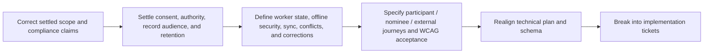

## Verdict

The set is **not yet safe to turn into implementation tickets**. The broad direction is sound, but critical product rules are either contradictory or absent at the points where consent, offline access, timestamps, record finalisation, conflict resolution, and supervisor correction meet. The latest decision-log entries settle only some questions: the later magic-link entry supersedes the earlier **administrator-MFA requirement only**; the v1 scope lock settles that “On my way” is optional and that participant real-time in-transit status, audio notes, Auslan video, billing, messaging, swaps, native apps, and public signup are out. Several source artifacts still present those settled items as required or open.

Review basis: all six artifacts and both Traycer critique lenses were read in full; all six comment-thread sets were checked (none exist). The current repository was sampled only to establish that it now contains an auth/design bootstrap with a single-organisation `profiles.organisation_id` model, but no production shift, service-note, portal, or offline implementation that resolves the gaps below.

## Verified strengths

| Area | What is solid |
| --- | --- |
| Privacy posture | The brief correctly treats qualified Australian privacy/security/NDIS advice as a pre-production gate and avoids claiming the artifacts are legal advice. Its summary of the NDIS information-management indicators—consent purpose, access/correction, accuracy, confidentiality, and appropriate retention/destruction—is directionally supported by current Commission guidance. |
| Authorisation | The technical plan makes database RLS, not UI state, the authority; separates private Storage access; avoids browser service-role credentials; and calls for access-matrix/RLS tests. These are appropriate load-bearing constraints. |
| Field-work orientation | The worker persona and research explicitly recognise old Android devices, dropped signal, glare, gloves, one-handed use, literacy pressure, large targets, visible labels, and low cognitive load. |
| Offline feedback intent | The reference flow distinguishes local intent time from server arrival time, preserves drafts on power loss, and tries to make queued/synced/conflict states visible rather than pretending an offline action succeeded remotely. |
| Scope control | Billing/claims, native apps, public signup, messaging, shift swaps, and real-time participant tracking are clearly excluded from v1 in the latest decision log. |

## Blockers / critical risks

### C1 — Consent, authority, and access are conflated

**Source claim/location.** Brief §Summary/§Outcome says external access is participant-authorised; technical plan §Authorisation allows a provider-created grant “attributable to consent”; stories S1.2/S1.5 let an administrator capture consent and grant external access; S3.3 lets a participant revoke “provider roles”; Persona 3 says a nominee “mirrors” participant access; S3.2 makes participant access depend on what the provider chooses to share.

**What breaks first.** A provider can implement an external grant without evidence that the participant—or a person with the relevant authority—approved that purpose, record category, recipient, and duration. “Nominee” is treated as one blanket authority even though plan and correspondence nominees have different NDIS roles, and provider-side disclosure authority still needs to be evidenced rather than inferred from a label. Internal staff access, participant self-access, nominee authority, and optional external disclosure become one revocable-grant concept. The portal also risks presenting statutory/practice-standard access and correction as discretionary sharing.

**Concrete correction.** Define separate product concepts and lifecycle rules for: participant identity; supported decision-making; nominee/guardian/attorney/representative authority type and evidence; internal operational access; participant portal visibility; external disclosure consent; and formal access/correction requests. For every grant settle issuer authority, purpose, record/field scope, recipient identity, effective/expiry dates, evidence, withdrawal/amendment, exceptions required by law, and what revocation does to sessions, offline caches, exports, and already-disclosed copies. Participant and nominee accounts must remain distinct; do not make “mirrors participant access” a default.

### C2 — The offline trust boundary exposes participant data after authority changes

**Source claim/location.** Reference flow §Sign-in/unlock says a local PIN/biometric unlocks a cached session offline; §State on device caches shifts for today plus seven days, planner details, drafts, and original photos; §Offline path assumes continued action while disconnected. The technical plan has no matching offline security contract.

**What breaks first.** A lost/shared phone, revoked worker, expired session, reassigned shift, or withdrawn participant consent can leave names, addresses, access instructions, observations, and photos readable while the server is unable to re-check authority. A local PIN is not a fresh Supabase authentication or authorisation decision. No rule covers device binding, cache minimisation, encryption, OS backup, expiry, failed-unlock wipe, logout, remote revocation, or the maximum period of offline use.

**Concrete correction.** Settle a user-visible offline access policy before designing the cache: minimum necessary fields and date range; whether highly sensitive notes/photos may be cached at all; device enrolment and local protection; maximum offline age and “last verified” display; re-authentication and lockout; logout/revocation/remote-wipe behaviour; cache expiry and deletion; and recovery when authorisation changed while offline. Make “offline data may be stale” and blocked-action states persistent, not toast-only.

### C3 — The shift → note → sync state machine cannot be implemented without inventing rules

**Source claim/location.** Decision log §v1 scope makes “On my way” optional, while the reference diagram and online/offline paths make it the only path to Start. Stories S2.3/S2.4 and reference §Complete shift finalise a note and mark a shift Completed, yet no action captures actual `ended_at`. S2.3 says the server records a device-clock value; the reference separately records local intent and server arrival. Edge cases drop queued actions on cancellation, preserve rejected notes locally, and say device-only drafts can resume on another device.

**What breaks first.** Workers cannot start directly when they skip “On my way”; scheduled end time may be mistaken for actual end time; clock skew is silently accepted; retries can duplicate commands; one conflict can block a FIFO queue; a cancelled/reassigned shift can discard genuine evidence; and a draft that never reached the server cannot appear on another device. Attachments can also arrive after a supposedly final record with no settled outcome.

**Concrete correction.** Specify one explicit state/command model covering Scheduled, optional In transit, Started, Ended awaiting note, Submitted locally, Syncing, Finalised, Conflict, Corrected, Cancelled, No-show, and Failed. Define each allowed transition, actor, required fields, planned/local-intent/server-receipt timestamps, idempotency, duplicate retry result, attachment ordering, foreground-sync fallback, cross-shift queue behaviour, and persistent resolution UI. Never silently drop service evidence: quarantine rejected submissions for a worker/supervisor decision, with authority-safe retention. Either sync drafts to a server draft state or remove cross-device-resume claims.

### C4 — Service-note audience, content, and photo rules are missing

**Source claim/location.** Story S2.4 and reference §Service note allow observation text and photos; S3.2 says a provider-selected record exposes observation text; the latest v1 scope instead promises a post-shift “service-note summary”; the technical plan relies on document classification without defining it.

**What breaks first.** A worker writes without knowing whether the participant, nominee, external user, or only staff will read the content. A participant may receive raw internal wording when the product promised a summary, while an administrator may hide records that should be accessible through an access/correction process. Photos introduce additional people, location metadata, intimate contexts, consent, retention, and offline-device exposure with no product rule.

**Concrete correction.** Decide the v1 record contract: required service-delivery fields, actual times, author attestation, audience/classification of every section, whether the participant sees the authored note or a separately authored summary, default sharing, redaction/review, attachments, and amendment visibility. Gate photo capture on a defined purpose and participant-specific authority, show the audience before capture/submit, strip unnecessary metadata, and specify removal/retention; otherwise remove photos from v1 rather than letting tickets invent policy.

### C5 — Critical support information and incident escalation fall between scopes

**Source claim/location.** Story S2.2 exposes planner notes including allergies, while reference §Open questions puts the full care plan/risk assessment out of scope. The only end-of-shift capture is a short service note, justified by “the worker is not a clinician.”

**What breaks first.** A worker can begin a service without the current critical instructions, communication method, risks, emergency contacts, or support constraints needed to deliver it safely. A safety concern can be buried in an ordinary note with no immediate escalation. NDIS Commission guidance expects incidents to be identified, recorded, managed, and escalated through an incident-management process; a service note is not that process.

**Concrete correction.** Define the minimum reviewed, time-stamped “critical support and safety” information available before Start, its offline availability, acknowledgement, and stale/missing state. Add an always-discoverable urgent-concern/incident handoff that states what happens now, who is contacted, what is recorded, and how the participant is supported. If incident management remains outside this CRM, explicitly route to the provider’s system and prohibit the service note from being the sole report.

### C6 — Compliance and security rationales overstate what has been established

**Source claim/location.** Decision log §Sydney residency says local hosting is a defensible way to meet the APPs; §Magic-link sign-in says it removes the phishing surface and satisfies NDIS “know your customer” requirements; §Account deletion asserts a participant right to removal, hard-purges PII after 30 days, but preserves subject and actor names. UI research says Radix is “accessible by default” and all recommended libraries need no licensing review.

**What breaks first.** Teams treat risk assumptions as settled law: Australian hosting does not itself resolve APP 8 cross-border recipients or APP 11 security; magic links remain exposed to phishing, forwarding, email-account compromise, and shared inboxes; a blanket 30-day purge may delete records still lawfully required while a named audit “skeleton” is still personal information; component primitives and axe do not establish WCAG conformance; dependency licences and versions can change.

**Concrete correction.** Reframe these as bounded product policies pending the brief’s qualified review. Produce a data-flow/subprocessor assessment, authentication threat model, role-specific assurance and recovery rules, and a per-data-category retention/destruction/legal-hold schedule. Distinguish withdrawal of consent, account closure, portal access removal, correction, and destruction/de-identification. Replace accessibility/licensing guarantees with verification requirements and an inventory/licence check.

## Major drift and contradictions

### M1 — Latest settled decisions have not propagated

**Source claim/location.** Technical plan §Security still requires administrator MFA before production, superseded by decision log §Admin sign-in. Reference §Flow overview still requires “On my way,” and §Open questions still asks about its requirement and participant real-time visibility, both settled by §v1 scope. UI research still asks about Auslan for v1 despite the same scope lock. Technical plan says the hosting vendor is unselected, while the later stack decision settles Vercel.

**What breaks first.** Different tickets implement mutually exclusive gates and UI: mandatory vs optional transit, MFA vs no MFA, real-time vs no real-time, and selected vs unselected hosting.

**Concrete correction.** Mark superseded passages explicitly and revise all derived acceptance criteria. Optional “On my way” must mean Start is always independently available; it does **not** imply the reference flow’s additional, unsettled “worker preference” setting.

### M2 — Identity and tenancy have three incompatible models

**Source claim/location.** Technical plan §Authorisation names `organisation_membership`; story S1.1 anticipates an email already active in another organisation; external Persona 4 works across providers. Current migrations instead bind one global auth user/profile to one `organisation_id` and one role.

**What breaks first.** The first worker, participant, nominee, or coordinator invited by a second provider cannot be represented cleanly; “explicit confirmation” cannot turn a single-org profile into a second membership. This also undermines active-organisation context and cross-tenant RLS tests.

**Concrete correction.** Settle global person/account versus per-organisation membership and per-participant grant boundaries, including role per organisation, multi-role people, invite collision/acceptance, active-organisation switching, external access across providers, and revocation. Then align the technical plan and existing schema before building portals or rosters.

### M3 — WCAG 2.2 AA is a slogan, not a testable acceptance model

**Source claim/location.** UI research §Accessibility lists selected criteria and makes axe/Pa11y plus quarterly worker keyboard tests the validation plan; it assumes the external portal needs no disability-specific work. The reference uses sticky footers, transient toasts, PIN entry, chips, and status changes without settled screen-reader/focus/error behaviour.

**What breaks first.** Automated checks pass while Focus Not Obscured, Accessible Authentication, status announcements, error prevention, zoom/reflow with the keyboard open, label-in-name, switch/voice access, forced colours, timeouts, and recovery remain broken. Participant and external users with cognitive, motor, hearing, vision, or language disabilities are reduced to generic baseline assumptions. W3C explicitly requires automated **and** human evaluation and recommends usability testing with a range of disabled users.

**Concrete correction.** Create a WCAG 2.2 AA acceptance matrix for every role, route, modal, offline/conflict/error state, and supported browser/AT pair. Run manual checks per material change and pre-release, not quarterly on the worker path alone. Add disability-inclusive research for screen-reader, magnification, switch/voice, motor, cognitive/intellectual disability, low literacy, hearing, and supported-decision-making needs; validate plain English/Easy Read and alternative formats with users rather than assuming a font or component library supplies them.

### M4 — Supervisor correction conflicts with the audit story

**Source claim/location.** Story S1.6 makes the audit panel read-only; reference §Edge cases says an administrator amends a finalised note “via the audit panel” and the worker receives an in-app notification. No story defines who may correct, reasons, approval, participant visibility, or an offline-submission collision with a correction.

**What breaks first.** Implementers either overwrite a final record, build editing into a supposedly read-only audit viewer, or expose inconsistent versions to participant/external users.

**Concrete correction.** Define a separate correction workflow: authorised roles, reason/evidence, immutable original plus new version, effective display, worker acknowledgement/dispute, participant/nominee correction request, external visibility, notification channel, and conflict precedence. Keep the audit panel observational and link to the authorised correction action.

## Gaps and ambiguities

### G1 — Field-use acceptance does not match the stated environment

**Source claim/location.** Persona 2 and UI research §Worker app specific promise one-thumb/glove/outdoor use; stories S2.1 and reference §Today list disagree between a one-line location hint and full addresses/access details. The note footer has two adjacent actions and sync confirmation is primarily a toast.

**What breaks first.** Shoulder-surfing exposes addresses; glare and gloves cause wrong taps; a transient toast disappears before a rushed worker knows whether evidence is safe; stale cached details look current.

**Concrete correction.** Minimise the list to the next-task hint, disclose full details only inside the assigned shift, show data age and persistent queue state, separate destructive/final actions, and field-test on agreed low-end Android/iPhone browsers under throttling, bright light, one hand, gloves, 200% text, and intermittent connectivity. Define measurable completion/error budgets rather than relying on 44 px alone.

### G2 — Participant, nominee, and external error/empty states are absent

**Source claim/location.** Stories S3.x/S4.x specify only successful viewing and an out-of-scope block. They do not cover pending/expired/revoked invitation, no current grant, consent withdrawn, no shared records, corrected record, inaccessible attachment, session expiry, or multiple participants/providers.

**What breaks first.** Users see a blank page or “not found,” cannot tell whether access ended or the system failed, and do not know how to request access/correction or contact the provider—while overly specific errors can leak record existence.

**Concrete correction.** Define non-leaking, plain-language states with effective dates, whose decision changed access, safe re-authentication, correction/access request and provider-contact paths, accessible help, and what remains visible after expiry or withdrawal. Use the person’s actual relationship label; do not collapse nominee, guardian, support coordinator, LAC, and referrer into one implied authority.

### G3 — Research and comparison claims lack provenance

**Source claim/location.** UI research §Reference landscape asserts products are “best-in-class,” “widely used,” weakly accessible, or performance-poor without sources or research method; the personas are presented as facts without participant/worker validation.

**What breaks first.** Product choices harden around competitor impressions and synthetic disability assumptions that cannot be audited or reproduced.

**Concrete correction.** Label the scan and personas as hypotheses unless evidence is attached; record dates, versions/surfaces observed, method, and source links; and validate the highest-risk hypotheses with workers, participants, nominees/representatives, and external users across access needs.

## Evidence boundary

This critique is product guidance, not legal advice. Primary sources checked for the factual pressure-test:

- [NDIS Commission — information management Practice Standards](https://www.ndiscommission.gov.au/rules-and-standards/ndis-practice-standards/core-module-provider-governance-and-operational)
- [NDIS Commission — incident management](https://www.ndiscommission.gov.au/rules-and-standards/reportable-incidents-and-incident-management/incident-management)
- [NDIS — nominee roles](https://www.ndis.gov.au/understanding-ndis/people-help-you/what-nominee)
- [OAIC — APP 8 cross-border disclosure](https://www.oaic.gov.au/privacy/australian-privacy-principles/australian-privacy-principles-guidelines/chapter-8-app-8-cross-border-disclosure-of-personal-information)
- [OAIC — APP 11 retention/destruction](https://www.oaic.gov.au/privacy/australian-privacy-principles/australian-privacy-principles-guidelines/chapter-11-app-11-security-of-personal-information)
- [W3C — WCAG 2.2](https://www.w3.org/TR/WCAG22/) and [understanding conformance](https://www.w3.org/WAI/WCAG22/Understanding/conformance.html)
- [MDN — Background Sync limited availability](https://developer.mozilla.org/en-US/docs/Web/API/Background_Synchronization_API)

## Remediation order

Use **`traycer-revise-requirements` next**. The immediate defect is not one isolated UX flow or one technical choice: the authoritative requirements are stale and mutually inconsistent across the brief, decisions, stories, reference flow, and technical plan. After revision, use `traycer-core-flows` for the four-role end-to-end behaviours, then `traycer-tech-plan` for the offline/identity/retention mechanisms.
