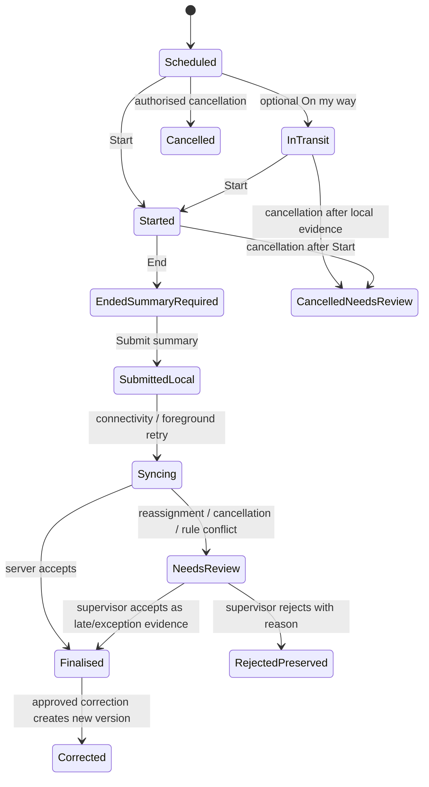
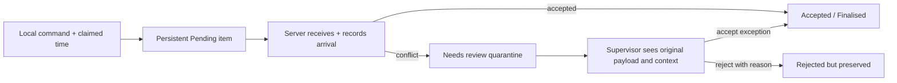

## Revision note

This flow replaces the earlier in-transit/service-note flow after the independent critique and Kevin's product decisions on 2026-08-06. It is product behaviour, not an implementation design. Technical choices for secure local storage, command delivery, background processing, and schema migration are settled later in the revised technical plan.

## Outcome

A worker can safely review current assigned work, see minimum critical information, optionally signal travel intent, record actual Start and End times, submit a participant-readable summary, and understand whether every action is pending, accepted, finalised, conflicted, or corrected—even through intermittent connectivity.

## Governing rules

- **On my way is optional.** It never gates Start and is not real-time participant tracking.
- **Start, End, and summary finalisation are separate events.** Note-writing time does not become delivered-support time.
- **Offline is bounded.** Only assigned current-day work and minimum necessary location/safety information remain usable, for at most 24 hours since the last server permission check.
- **Evidence is never silently dropped.** A server rejection or conflict preserves the submitted command/summary for authorised review.
- **The summary has a known audience.** It is plain English, contains no photos/audio in v1, and becomes participant-visible only after successful finalisation.
- **Urgent concerns use a separate handoff.** An ordinary service summary is not an incident report.
- **The handoff has a real configured destination.** Before worker delivery actions are enabled, the provider configures current emergency and incident routes with plain-language guidance, an owner label, a primary phone/URL, a fallback phone and an effective window. Australian emergency services (`000`) remains visibly distinct from the provider's own process.
- **Handoff evidence is truthful and narrow.** Choosing a channel records only that the worker initiated the handoff. An explicit worker confirmation may record that they followed the instructions, but the product never infers that a call connected, that the provider acknowledged it, or that an incident was reported. A launch failure may be recorded separately. Investigation and case management remain outside the CRM.
- **The first worker loop is deliberately narrow.** One shift represents one worker, one participant and one individual time-based support item. Group, multi-item, transport/activity-quantity and specialist-module evidence cannot be represented as ready.
- **Every shift has one ready service context.** The context must be active, current, reviewed and inside a provider-selected row that the product supports. Draft, review-required/disputed, superseded, withdrawn, expired, mismatched, phased and unsupported contexts block new work.
- **Worker readiness is enforced before assignment.** Screening uses the strictest applicable registered-provider/risk-role, provider-policy and participant/service-context rule. An unregistered-provider role needs an explicit effective required/not-required decision; missing policy and every known adverse screening state block readiness. Every provider-required competence item remains current/met. There is no generic or per-shift override.
- **Acknowledgement is separate from finalisation and actor source is explicit.** Before Ticket 08, the provider may record an external signed/declined evidence attestation or unavailable/not-obtained attempt. Attempts never replace the current conclusive outcome; corrections explicitly supersede the expected event and conflicts go to review. Only an evidence-backed participant, child representative, plan nominee or legal guardian may be reported as signer/decliner. Provider records are never labelled participant-authenticated.

## State model



### State meanings

| State | What the worker sees | What others may treat as authoritative |
| --- | --- | --- |
| Scheduled / In transit | Current assignment and optional travel intent | Current server roster only |
| Started | Start accepted, or a persistent Pending badge if offline | Accepted server event only |
| Ended—summary required | Actual End captured; summary remains due | Accepted Start/End events; no final service summary yet |
| Submitted locally / Syncing | Persistent queue item with claimed local time and retry status | Not a final participant record |
| Finalised | Synced confirmation and current summary | Participant sees it; eligible external users see it only if their grant includes summaries |
| Needs review | Plain explanation, preserved evidence, provider contact, and review status | Not participant-visible as a final record |
| Corrected | Current version plus visible correction indicator | Original and every version remain immutable |

## Journey

### 1. Unlock and verify context

The app names the signed-in person, active provider organisation, connectivity, and last successful permission verification. Offline local unlock is allowed only on an enrolled/protected device and does not pretend to be a fresh server authorisation.

If the last server verification is older than 24 hours, participant details and sensitive actions are blocked. The worker sees a provider contact action and can still access non-sensitive app help.

### 2. Today

```wireframe
<!doctype html><html><head><style>
body{font-family:Inter,system-ui;margin:0;background:#f7f8fa;color:#17202a}header{padding:16px;border-bottom:1px solid #ccd3da}h1{margin:4px 0}.context,.fresh{font-size:13px;color:#465565}.shift{margin:12px;padding:16px;background:white;border:1px solid #ccd3da;border-radius:14px;min-height:72px}.shift b{display:block}.status{margin-top:8px;font-weight:700}.pending{color:#8a4b00}.urgent{position:fixed;right:16px;bottom:16px;padding:14px;background:#8b1e2d;color:white;border-radius:12px;font-weight:700}</style></head><body>
<header><div class="context">Open NDIS · Worker</div><h1>Today</h1><div class="fresh">Offline · permissions checked today at 07:42</div></header>
<div class="shift"><b>09:00 · Maya R</b><div>Fairfield · tap for assigned details</div><div class="status">Scheduled</div></div>
<div class="shift"><b>13:30 · Daniel K</b><div>Parramatta · tap for assigned details</div><div class="status pending">End pending sync · summary required</div></div>
<div class="urgent">Urgent concern</div>
</body></html>
```

- Only current-day assigned shifts are cached.
- The list shows a minimal location hint; the full address and critical information require opening the assigned shift.
- Connectivity, last verification, pending evidence, and conflict state remain visible; a toast may announce change but is never the only record of state.

### 3. Shift detail and critical information

The detail screen shows participant first name, full location/access instructions, scheduled time, current assignment, the single snapshotted support item and participant-goal display, and a compact **Critical support and safety** card with owner, last-reviewed time, and review-due time. It does not expose the participant's NDIS identifier or office-only evidence references.

If the card is missing or stale:

1. A persistent warning explains the condition.
2. The provider contact action is immediately available.
3. The worker acknowledges the warning.
4. Start remains available so software does not automatically cancel essential support.

The always-visible Urgent concern action shows `000` for immediate danger and the provider-defined emergency and incident-process contacts, including the fallback route and provider-owned guidance. It explains what to do now and never instructs a worker to wait for a service summary to report immediate risk. If no current provider route exists, delivery actions fail closed and the screen explains that the provider must configure its safety handoff; `000` remains available for immediate danger.

Selecting a provider phone/URL first creates an append-only `initiated` receipt, then opens the operating-system channel. The worker can separately mark “I followed these instructions,” which records `worker_confirmed` rather than provider acknowledgement. A channel-launch problem records `failed` with a non-sensitive reason and keeps the fallback visible.

### 4. Optional On my way

On my way may be used from Scheduled but is never the only path to Start. It records a claimed local time and later server receipt time. V1 does not expose live travel location or a real-time participant arrival signal.

### 5. Start

Start is one primary action. The resulting command receives a visible state:

- **Accepted** when confirmed by the server.
- **Pending** when stored locally awaiting delivery.
- **Needs review** if the server later identifies a conflict.

The app may warn about an unusually early or late claimed time, but it records the actual action rather than silently replacing it with the schedule.

### 6. End

End captures the actual end of delivered support independently of summary writing. The shift becomes **Ended—summary required**. Ending does not show Completed and does not publish anything to the participant.

### 7. Participant-readable summary

```wireframe
<!doctype html><html><head><style>
body{font-family:Inter,system-ui;margin:0;background:#f7f8fa;color:#17202a}header,main{padding:16px}header{border-bottom:1px solid #ccd3da}.audience{padding:12px;background:#eaf3ff;border-radius:10px;margin-bottom:16px}.field{margin:16px 0}.field b{display:block;margin-bottom:6px}.box{min-height:100px;background:white;border:1px solid #9aa7b3;border-radius:12px;padding:12px}.state{padding:12px;border:2px solid #c56a00;background:#fff4df;border-radius:10px}.actions{position:sticky;bottom:0;background:white;padding:12px;display:flex;gap:12px}.button{min-height:52px;padding:0 16px;border-radius:12px;display:flex;align-items:center;justify-content:center}.secondary{border:1px solid #667785;flex:1}.primary{background:#17202a;color:white;flex:2}</style></head><body>
<header><b>Service summary</b><div>Maya R · actual time 09:03–10:58</div></header><main>
<div class="audience"><b>Who will see this?</b><br>Visible to Maya after successful finalisation. External users only when their active grant includes service summaries.</div>
<div class="field"><b>Support provided</b><div>Structured activity choices</div></div>
<div class="field"><b>Plain-English summary</b><div class="box">Describe the support provided and relevant outcome. Do not use this box for an urgent incident.</div></div>
<div class="state"><b>Offline</b><br>Submission will remain Pending until the server accepts it.</div>
</main><div class="actions"><div class="button secondary">Save draft</div><div class="button primary">Submit summary</div></div>
</body></html>
```

- The audience is shown before submission.
- The single snapshotted support item, goal display and exact accepted Start/End duration are shown read-only; the worker cannot change the service item or enter a billable/rounded quantity during summary writing.
- No photos, audio, or other attachments are offered in v1.
- An urgent concern remains reachable from this screen.
- An offline-only draft is available only on that enrolled device. Cross-device resume is promised only after a draft reaches a server draft state.

### 8. Sync, finalisation, and conflict

Each queued command has its own unique identifier and may progress independently, so one conflicting shift does not block unrelated evidence.



The worker sees the result and provider contact. The product never says “synced” until the server accepts it. Cancelled or reassigned shifts may disable future actions, but evidence already captured is quarantined rather than deleted.

### 9. Participant visibility and correction

After successful finalisation, the participant sees actual Start/End times, worker name, structured activities, and the current plain-English summary. External users see it only when their current consent-backed grant includes service summaries.

A worker or participant may request correction. An authorised supervisor creates a reasoned corrected version; the original remains immutable, the worker is notified, and the participant sees the current version plus a correction indicator. The audit viewer remains read-only and links to the separate correction action.

## Edge cases

| Case | Required behaviour |
| --- | --- |
| Connectivity drops** mid-shift** | Continue only if permission was verified within 24 hours and the shift/current-day minimum data were cached; show persistent offline and freshness state. |
| Reassignment/cancellation arrives after local Start or End | Block future actions when known; preserve existing evidence in Needs review. Never drop it with a toast. |
| Multiple device**s** | Server-accepted state wins as authoritative; offline-only drafts stay device-local and are labelled accordingly. |
| Clock skew | Preserve claimed local time, device offset/time zone, and server arrival; surface material anomalies for review rather than silently rewriting. |
| Duplicate retry | Return the existing result for the command identifier; do not create a second Start, End, or summary. |
| One queue item conflicts | Other independent items continue; the conflict receives its own persistent review state. |
| App closes or battery dies | Recover locally saved commands/draft on the enrolled device and show their exact pending state. |
| Missing/stale critical information | Warn, require acknowledgement and provider-contact guidance, but do not automatically block Start. |
| Urgent safety concern | Always-visible handoff to provider emergency/incident process; the ordinary summary is not the sole report. |
| Participant or external access ends | Future portal access stops at server enforcement; cached access is purged at next contact. UI does not claim already disclosed copies can be recalled. |

## Product acceptance checks

- A worker can Start without using On my way.
- Actual End is captured before summary writing and Completed is not shown until finalisation.
- Offline for less than 24 hours works only for current-day assigned work and minimum necessary data.
- Every pending/conflicting item is recoverable and persistent after transient announcements disappear.
- Participant visibility begins only after successful finalisation.
- A registered-provider risk-assessed shift cannot be created for a worker with missing, expired, suspended or excluded clearance unless a complete named screening pathway applies; missing/expired/failed provider-required competence still blocks it.
- Final records retain one service-context/item/goal snapshot and exact accepted elapsed time without billing claims, while acknowledgement source/status progresses separately and never blocks summary finalisation.
- No photo/audio control appears.
- Missing/stale critical information and Urgent concern can be handled without hiding or cancelling the shift.
- At 200% text, 320 CSS px reflow, mobile keyboard open, screen reader, keyboard/switch/voice input, reduced motion, and forced colours, primary actions, status, errors, and recovery remain perceivable and operable.

## Technical questions intentionally deferred

- Device enrolment, encryption/key storage, OS backup exclusion, failed-unlock policy, logout/revocation purge, and remote response to a lost device.
- Ticket 07's device-side queue scheduler, supported-browser recovery behaviour, and optional Background Sync enhancement; the server command, idempotency, receipt, and quarantine contracts are already settled.
- Data-category retention, legal hold, access/correction response timing, and destruction/de-identification rules pending qualified advice.
