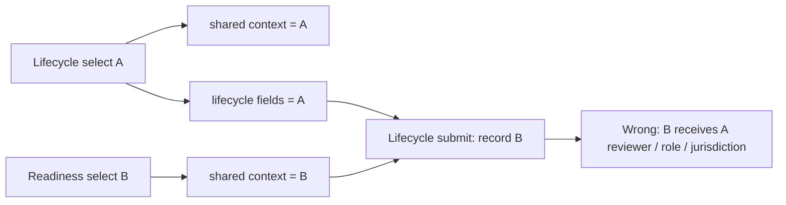

## Verdict

**DO NOT MERGE** HEAD `797213b3a920305c701d02b94ae41f0b9af62b32` over frozen parent `84f07f3c58deb21169f583c3df174bc879024580`.

All five database P0/P1 findings are closed by direct, de-confounded PGlite reproductions, and every standard local gate passes. Three UI P1 obligations remain incomplete: material evidence dates are still hard-coded, the lifecycle and readiness forms still share a context identifier and can cross-apply record A's lifecycle values to record B, and the readiness audit view still omits loaded screening/pathway expiry windows.

## Per-finding closure

| Prior finding | Status | Exact reproduction / evidence |
| --- | --- | --- |
| DB P0 — effective roles | **CLOSED** | Fresh PGlite: inserted an explicit withdrawn `admin` role row; `membership_has_role(...,'admin') = false` and `cmd_admin_create_provider_scope_version` raised `admin_or_scheduler_required`. Inserted an explicit withdrawn assigned-worker role; `membership_has_role(...,'worker') = false`, readiness returned `{ready:false, reason:'worker_membership_invalid'}`, and Start returned `{status:'conflict_preserved', reason:'not_assigned'}`. Final guards are at `0009_provider_readiness_service_evidence.sql:654-663,674-690,784-800`. |
| DB P0 — partial-interval rules | **CLOSED** | Fresh PGlite 10:00–11:00 probe with a required policy ending 10:30 plus pending clearance returned `{ready:false, reason:'screening_not_current'}`. A required competence row ending 10:30 plus `not_met` evidence returned `{ready:false, reason:'competence_not_current'}` and `cmd_admin_create_service_ready_shift` raised `provider_not_ready`. Segment/range logic is at `0009...sql:694-723`. |
| DB P1 — acknowledgement authority at event time and exact scope | **CLOSED** | Fresh PGlite with confounders removed: participant-self event before `linked_at` raised `ack_authority_not_allowed`; a plan nominee effective at event time but scoped only to `service_summary` raised the same; a `service_acknowledgement` authority valid on 7 Aug and revoked on 9 Aug was accepted for the 7 Aug event. The accepted event stored `authority_source_type='representative_authority'` and the exact authority row ID; attempting to update that ID raised `immutable_evidence`. See `0009...sql:732-769`. |
| DB P1 — urgent review propagation | **CLOSED** | Started shift changed to `urgent_provider_review` after its risk-role window was shortened. A separate effective worker-role withdrawal also changed it to `urgent_provider_review`. Catalogue inspection shows `ticket05b_lock_membership_roles` is a `BEFORE INSERT OR DELETE OR UPDATE` trigger calling `lock_05b_readiness`; inside a single transaction the role write held a granted advisory `ExclusiveLock`. See `0009...sql:607-652`. |
| DB P1 — idempotency | **CLOSED** | Created capability, withdrew its scope, retried the exact command ID/arguments: result was `duplicate_returned` with the same receipt and original capability outcome. Catalogue inspection found the actor-bound completed-receipt lookup before reservation/mutable validation in all 15 new 05b command functions. See `0009...sql:773-830` and the analogous command definitions. |
| UI P1 — controlled values | **NOT CLOSED** | Scope, role text/assessor/risk flag, policy, verification/adverse flags, requirement, and most evidence fields now have controlled inputs. However `effectiveFrom`/`effectiveUntil` are mount-time constants with no setters (`workspace-client.tsx:875-876`); risk-role submit still sends `p_assessed_at: effectiveFrom` (`:971`), and competence evidence still sends `p_expires_at: effectiveUntil` (`:966`) without assessment-date or expiry controls. This misses the explicitly required controlled assessment and evidence-expiry values. |
| UI P1 — context lifecycle bound to selected context | **NOT CLOSED** | Two-context mounted reproduction: select lifecycle context A (reviewer A, role A, NSW), then select readiness context B (reviewer B, role B, VIC), then submit lifecycle. RPC received `p_context_id='ctx-b'` with `p_reviewer_profile_id='review-a'`, `p_role_version_id='role-a'`, `p_jurisdiction='NSW'`. Root cause: both forms share `context` (`workspace-client.tsx:856,887`); lifecycle selection hydrates via `chooseLifecycleContext` (`:926-933`), while readiness selection changes only `setContext` (`:995`), and lifecycle submit uses the mixed state (`:990`). |
| UI P1 — audit presentation | **PARTIALLY CLOSED** | The card now labels workers, roles, requirements and supervisors and shows references, sources/verifiers/issuers, effective windows, adverse states and competence limitations; the acknowledgement ledger shows record ID, recorder, signer, occurrence, authority lineage, method, evidence and exact supersession (`workspace-client.tsx:983,1007`). But screening `clearance_expires_at` and pathway `pathway_start/pathway_end` are loaded (`page.tsx:37-38`) and never rendered in the evidence card (`workspace-client.tsx:983`), so the required expiry/validity windows remain unauditable. |
| UI P1 — readiness freshness | **CLOSED** | Fingerprint covers worker/context/start/end (`workspace-client.tsx:893-894`); an async result records the checked fingerprint (`:917-924`); changed inputs replace the visible Ready state with “Inputs changed” and disable Create unless the current fingerprint still has `ready:true` (`:995-997`). Mounted scheduler reproduction passed. |
| UI P1 — scheduler role gating | **CLOSED** | Provider scope, capability, catalogue, risk role, screening policy, competence requirement and lifecycle submit buttons all gate on `actorRole !== 'admin'` (`workspace-client.tsx:946,951,956,973,976,982,993`). Verification, pathway, competence evidence, readiness, service creation and acknowledgement remain available. Mounted scheduler coverage passed; server RPC authority remains the final guard. |

## Remaining blockers and corrections

### P1 — controlled assessment and expiry dates remain synthetic constants

`src/app/app/admin/workspace-client.tsx:875-876,966,971`

Add dedicated controlled date/time inputs for risk assessment date and competence-evidence expiry (nullable where the contract permits) and pass those states to `p_assessed_at` and `p_expires_at`; mount-submit non-default values.

### P1 — readiness selection can cross-write lifecycle values

`src/app/app/admin/workspace-client.tsx:856,887,926-933,990,995`

Split `lifecycleContextId` from `readinessContextId`, derive separate selected records, and ensure only the lifecycle selector hydrates/submits lifecycle state for its own selected record; add the two-record mounted regression above.

### P1 — screening/pathway expiry windows are absent from the audit view

`src/app/app/admin/page.tsx:37-38`; `src/app/app/admin/workspace-client.tsx:983`

Render screening clearance expiry and pathway start/end beside their effective windows, and assert those exact labels/values in mounted audit coverage.

## Gates and review probes

| Check | Result |
| --- | --- |
| Commit/worktree | Exact HEAD and parent confirmed; clean before and after temporary mounted probe |
| `pnpm db:parse` | Pass — migrations 0001 through 0009 |
| `pnpm db:test` | Pass — 16 files, 173/173 tests |
| Focused fixup + mounted suite | Pass — 27/27 tests |
| Independent PGlite probes | Pass for all five DB findings, including de-confounded exact-scope and explicit withdrawn-role cases |
| Independent two-context mounted lifecycle probe | **Fail as expected** — B submitted with A's lifecycle values; temporary probe removed and worktree restored clean |
| `pnpm lint` | Pass |
| `pnpm typecheck` | Pass |
| `pnpm build` | Pass |
| `git diff --check 84f07f3c58deb21169f583c3df174bc879024580..HEAD` | Pass |

## Explicit non-blocking exclusions

- The `legacy_incomplete` reassignment selector remains as the stated P2 deviation and is not counted against this verdict.
- Authenticated browser, mobile, keyboard, zoom and assistive-technology testing remains unrun because no browser is available. Mounted DOM tests do not close that gate, but this is not counted as a merge blocker for this review.

## Merge gate

**DO NOT MERGE** until the three UI P1 corrections above are implemented and mounted with non-default controlled dates, a two-context lifecycle/readiness separation test, and expiry-window audit assertions. Re-run the full local gates afterward.
