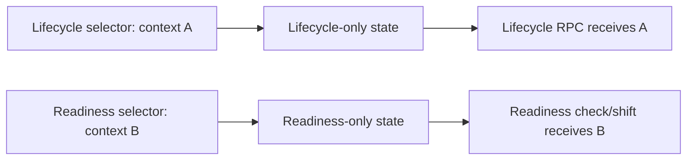

## Verdict

**SAFE TO MERGE** HEAD `8848c77e1a519efc56b6d672bc63bf1befd6fd5f` over parent `797213b3a920305c701d02b94ae41f0b9af62b32`.

All three scoped UI P1 corrections are **CLOSED** by direct source inspection, isolated committed mounted tests, and an independent mounted regression probe. No merge blocker remains in this review scope.

## Change boundary

`git diff 797213b3a920305c701d02b94ae41f0b9af62b32..8848c77e1a519efc56b6d672bc63bf1befd6fd5f` changes exactly the two expected files:

| File | Diff |
| --- | --- |
| `src/app/app/admin/workspace-client.tsx` | UI state, submit wiring, context separation, audit labels |
| `tests/admin-workspace-mounted.test.tsx` | 3 mounted regressions |

Total: **2 files changed, 100 insertions, 16 deletions**. No migration or DB-test file changed. The worktree was clean at the requested HEAD before verification and after removal of the temporary reviewer probe.

## Per-finding closure

| Finding | Status | Exact reproduction / evidence |
| --- | --- | --- |
| 1 — Controlled assessment and competence-expiry dates | **CLOSED** | `workspace-client.tsx:833,839` holds distinct controlled states. `:971` renders an actual controlled `Evidence expiry` `datetime-local` input; `:977` renders an actual controlled, required `Assessment date` input. Submits at `:970,975` convert non-empty local values with `new Date(...).toISOString()`; empty expiry maps to `null`. The committed mounted test at `tests/admin-workspace-mounted.test.tsx:293-325` enters non-default `2026-07-14T09:30` and `2027-02-03T17:45` values and asserts the respective RPC arguments. Isolated result: **1 passed, 23 skipped**. Independent mounted probe cleared expiry and chose assessment `2026-11-19T14:05`; the calls contained `p_expires_at: null` and the selected assessment value in ISO form. Probe result: **1/1 passed**. |
| 2 — Lifecycle/readiness context separation | **CLOSED** | State is split at `workspace-client.tsx:858-859`; selected records are split at `:890-891`. Readiness fingerprint/read uses only `readinessContextId` and `selectedReadinessContext` at `:897,924-925`; lifecycle hydration uses only `lifecycleContextId` at `:930-936`; lifecycle submit and selector use only lifecycle state at `:994-995`; readiness form/shift use only readiness state at `:999-1001`. The committed mounted test at `tests/admin-workspace-mounted.test.tsx:327-357` selects lifecycle A and readiness B, then asserts A's context ID, reviewer, role and jurisdiction reach the lifecycle RPC while B's values do not. Isolated result: **1 passed, 23 skipped**. Independent mounted variant selected lifecycle A, changed readiness to B, then submitted lifecycle; the RPC received `context-a`, `reviewer-a`, `role-a`, `NSW`, not B/VIC. Probe result: **1/1 passed**. |
| 3 — Audit-card expiry windows | **CLOSED** | `workspace-client.tsx:987` renders the exact literal DOM labels `Clearance expires`, `Pathway valid from`, and `Pathway valid to` beside their loaded values and effective windows. The mounted test at `tests/admin-workspace-mounted.test.tsx:359-370` supplies a clearance expiry plus pathway start/end and asserts every exact label/value pair is visible. Isolated result: **1 passed, 23 skipped**. |

## Required gates

| Gate | Exact result |
| --- | --- |
| `pnpm install --frozen-lockfile` | **PASS** — already up to date; pnpm 11.20.0 |
| `pnpm db:parse` | **PASS** — 11 migrations parsed, `0001` through `0009` including `0008b` and `0008c` |
| `pnpm db:test` | **PASS** — **16 files, 176/176 tests** |
| `pnpm lint` | **PASS** — zero errors |
| `pnpm typecheck` | **PASS** — `tsc --noEmit`, zero errors |
| `pnpm build` | **PASS** — Next.js 16.3.0 optimized production build compiled and generated all routes |
| `git diff --check 797213b..HEAD` | **PASS** — no output |
| Targeted date test | **PASS** — 1 passed, 23 skipped |
| Targeted context-separation test | **PASS** — 1 passed, 23 skipped |
| Targeted audit-window test | **PASS** — 1 passed, 23 skipped |
| Independent combined mounted probe | **PASS** — 1/1; temporary test removed |

## Parent DB closure integrity

The five database P0/P1 findings remain **CLOSED** as established at parent `797213b`: the fixup diff contains no database migration or DB-test changes, migration parsing is green, and the full 16-file/176-test suite—including the parent DB closure regressions—passes. This review did not re-litigate the unchanged DB implementation.

## Explicit non-blocking exclusions

- The P2 legacy-selector issue remains explicitly out of scope and does not block this verdict.
- Authenticated browser, mobile, keyboard, zoom and assistive-technology verification remains unclosed because no browser was available. Mounted DOM tests do not substitute for those checks, but they are explicitly non-blocking for this review.

## Merge gate

**SAFE TO MERGE.** No scoped P0/P1 blocker remains.
