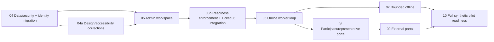

## Full-v1 MVP delivery sequence

These tickets are planning drafts until Kevin approves execution. Testing uses synthetic data only.

The first representative test release is `04 + 04a → 05 → 05b → 06`. It lets Kevin configure one supported individual-time service, satisfy a synthetic worker's screening and role-competence requirements, activate a reviewed participant context, create one immutable service-ready shift, and complete the online worker loop. The approved MVP target remains the full v1 pilot scope through ticket 10.

Completed tickets 01–03 remain historical `status: 2` records. Their supersession notes point to corrective work rather than rewriting what was built.
