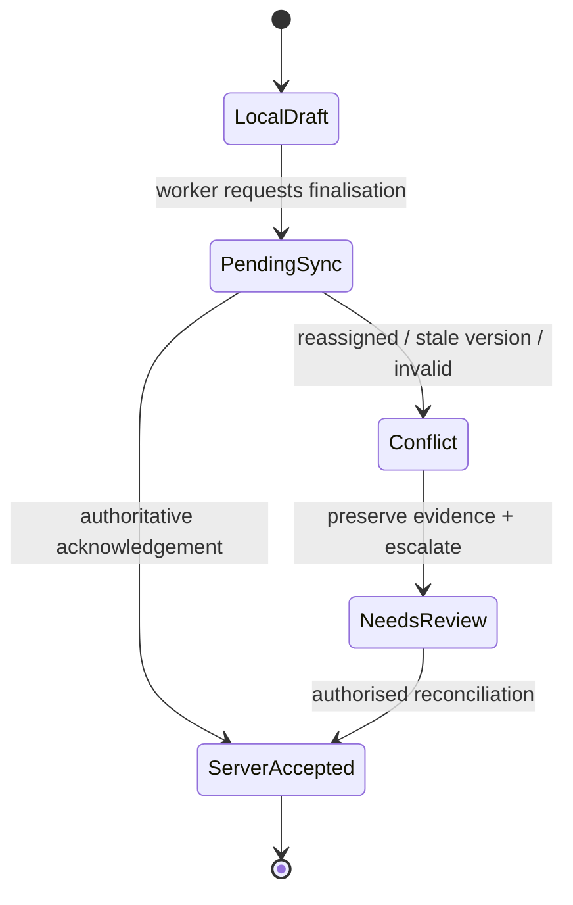

## Verdict

The direction is strong on mobile ergonomics, least-privilege intent, and making offline work visible. It is **not yet safe or specific enough to implement the pilot**. The central defect is that the documents blur three different states—saved on the device, accepted by the server, and legally/auditably finalised. Consent authority, lost-device/revoked-access behaviour, and safety escalation are also unresolved while downstream documentation calls the foundation “settled.”

Reviewed: `ndis-provider-crm-brief`, `ndis-provider-crm-technical-plan`, `ui-ux-research`, `ui-personas-and-stories`, `reference-flow-shift-and-service-note`, and `02-design-system-foundation`. No comment threads were present. The original artifacts were not modified.

## Priority findings

| Priority | Finding | What breaks first | Required change |
| --- | --- | --- | --- |
| **P0** | Offline “submit/finalise/complete” is not a truthful state | A worker sees Completed, but a later reassignment or validation rejection means no authoritative service record exists. | Define separate `local_draft`, `pending_sync`, `server_accepted`, `conflict`, and `needs_review` states. Never say “submitted,” “finalised,” or “completed” until server acknowledgement. |
| **P0** | Sensitive offline storage has no security or revocation contract | A lost/shared phone or revoked worker can retain addresses, access instructions, notes, photos, and a cached session. | Add an offline threat model and explicit cache minimisation, expiry, re-authentication, wipe, logout, lost-device, membership-revocation, and storage-quota behaviours before building Dexie/Serwist. |
| **P0** | Consent, nominee authority, and provider access are conflated | An administrator may grant external access without evidenced participant authority; “revoke any grant (subject to provider policy)” gives no implementable rule. | Separate provider workforce permissions, participant/nominee authority, and external disclosure grants. Specify who can grant/revoke each, required evidence, effective time, exceptions, notifications, and offline propagation limits. |
| **P0** | The shift flow has no safety/incident branch | A worker experiencing an incident, safeguarding concern, medication issue, or emergency has only a generic service note and optional photo. | Add a visible urgent-help/escalation route and state explicitly that a service note is not an incident report. Set attachment consent, bystander, EXIF, retention, and upload-failure rules. |
| **P1** | WCAG intent is good, but conformance is not operationalised | Sticky footers/banners can obscure focus; PIN authentication can create a cognitive test; queue/conflict changes may not be announced. Automated tests will miss many of these. | Create a per-flow accessibility acceptance matrix covering WCAG 2.2 AA, including 2.4.11, 2.5.3, 3.3.8, and 4.1.3; test every release with keyboard, VoiceOver, TalkBack, zoom/reflow, forced colours, and representative disabled users. |
| **P1** | Only the worker happy path is designed to reference-flow depth | Teams must invent admin roster conflicts, invite/MFA recovery, consent withdrawal, participant access, expired grants, empty/error states, and non-digital support. | Add minimum end-to-end reference flows for admin rostering, grant/withdrawal, participant/nominee access, and external expiry/denial before tickets are broken down. |
| **P1** | Several PWA/platform promises are not portable | Background Sync and vibration are not broadly available; a web app cannot simply offer an offline “biometric unlock” without a defined authenticator design. | Make foreground/app-open retry the guaranteed sync mechanism; treat Background Sync, audio, and vibration as progressive enhancement. Specify WebAuthn/passkey capability detection and an accessible fallback. |
| **P1** | The completed design-system ticket overstates its result | The reference route does not read values with `getComputedStyle`, omits tokens and installed component samples, and returns a blank production route rather than not shipping. | Reopen or supersede the acceptance record; verify the actual route, every token, and every promised component. Add automated accessibility checks to the delivery plan. |
| **P2** | Research claims are presented as findings without evidence | “Best-in-class,” “widely used,” and competitor strengths may become product decisions despite no method, date, source, or user sample. | Relabel the landscape as a heuristic scan, cite dated evidence, and distinguish desk research from interviews/usability testing. |
| **P2** | Data minimisation and service-note content rules are underspecified | Full addresses/access hints appear in glanceable lists and notifications; workers can write or photograph content that should not be broadly shared. | Define shoulder-surf/notification redaction, same-first-name disambiguation, role-based field classification, respectful note-writing guidance, and participant-visible versus internal fields. |

## P0 detail: make offline truth explicit

The current documents contradict one another:

- S2.3 says the **server** records `started_at` “using the device clock”; the reference flow later distinguishes local time from server arrival time.
- Offline Submit immediately moves the shift to **Completed**, although the edge-case table allows the server to reject it later.
- “Drafts … resume from any device once online” is impossible while the state table says drafts exist on-device only until submit.
- A cancelled shift causes queued actions to be “dropped,” which can destroy evidence of work already performed.

Use an idempotent outbox contract with client-generated operation IDs, dependency order, server versions, retry rules, clock-skew handling, and a non-destructive reconciliation inbox. Preserve disputed submissions for authorised supervisor review; do not silently drop them.

## P0 detail: define the offline security boundary

“PIN unlock works against cached credentials” is not a sufficient security design for sensitive browser storage. Specify whether the PIN protects only the UI or cryptographic material, how failed attempts and session age work, whether first use requires online authentication, and what happens when the server revokes access while the device is offline. WebAuthn can request local user verification, but it is an online authentication ceremony with a relying party—not a generic promise that cached Supabase data is securely unlocked offline. See the [W3C WebAuthn specification](https://www.w3.org/TR/webauthn-3/).

At minimum, constrain cache contents and horizon; require a bounded reconnect/re-authentication interval; wipe on explicit logout, organisation change, and detected revocation; hide participant data in the app switcher/notifications; remove synced photo originals; and document the residual limitation that remote revocation cannot reach an offline device immediately.

## P0 detail: settle authority and withdrawal semantics

The brief promises participant-authorised external access, but S1.5 lets an administrator create a grant without participant-authorisation evidence as a precondition. S3.3 then groups provider roles, nominees, and external coordinators into one “grant” list even though their legal/operational bases differ. “Nominee … mirrors her own access” is also too broad to implement safely: authority may be scoped, time-bounded, supported, disputed, or changed.

Add a grant lifecycle with authority type, evidence, purpose, permitted record classes, issuer, subject, effective/expiry times, withdrawal source, retention basis, and audit event. UX must show what changes immediately, what remains retained, and that already-cached offline data is withdrawn only when the other device reconnects. Qualified Australian NDIS/privacy review remains a release gate.

## P1 detail: turn accessibility assertions into testable requirements

The baseline omits several WCAG 2.2 risks created by its own UI: sticky action bars and banners must not entirely obscure focus (2.4.11); voice-control labels must match visible names (2.5.3); PIN/authentication needs an accessible alternative or assistance (3.3.8); and queued/synced/conflict changes need programmatic status announcements (4.1.3). See [WCAG 2.2](https://www.w3.org/TR/WCAG22/) and [W3C target-size guidance](https://www.w3.org/WAI/WCAG22/Understanding/target-size-minimum).

The 44 CSS px worker target is a useful product floor and aligns with Apple’s default 44×44 pt control guidance, but Android recommends 48×48 dp. Use a **48 CSS px worker-app target floor** unless usability testing supports a deliberate exception. See [Apple accessibility guidance](https://developer.apple.com/design/human-interface-guidelines/accessibility) and [Android accessibility guidance](https://developer.android.com/guide/topics/ui/accessibility/views/apps-views).

Automated axe/Pa11y gates cannot establish conformance or usable task completion. The validation plan needs release-level manual testing and research with disabled people, not a quarterly keyboard pass. The Australian Digital Service Standard explicitly calls for marginalised users’ voices, non-digital pathways, device/platform testing, low-bandwidth design, feedback mechanisms, and human-validated multilingual support for critical information. See [Criterion 3 — Leave no one behind](https://www.digital.gov.au/policy/digital-experience/digital-service-standard/criterion-3) and the [Australian Government Style Manual forms guidance](https://www.stylemanual.gov.au/content-types/forms).

Also correct the foundation tokens: `#16a34a` with white is about **3.30:1**, and `#0ea5e9` with white about **2.77:1**. Those foreground pairs fail 4.5:1 for normal text despite the token comment claiming an AA body-text target. Validate semantic foreground/background pairs, tenant overrides, focus, forced-colour mode, and every interaction state—not isolated brand colours.

## P1 detail: use reliable PWA fallbacks

The Background Synchronization API is not available across all widely used browsers, and the Vibration API is likewise limited. See [MDN Background Synchronization](https://developer.mozilla.org/en-US/docs/Web/API/Background_Synchronization_API) and [MDN Vibration API](https://developer.mozilla.org/en-US/docs/Web/API/Vibration_API). The guaranteed contract should be: durable outbox plus retry on app launch, foreground, manual “Sync now,” and connectivity restoration while open. Background execution, sound, and haptics should enhance that contract, never carry safety-critical feedback, and respect user settings.

## P1 detail: correct the “complete” foundation record

Cold inspection of the implemented foundation shows material acceptance mismatches:

- `/design-system` renders token references as `var(--token)` but does not call `getComputedStyle`; it omits multiple defined tokens.
- It samples Button, Card, Input, and Label, but not Dialog, Dropdown Menu, Sheet, or Sonner as required.
- The production branch returns `null`, so the route is still compiled/addressable as a blank page; that is not equivalent to “doesn't ship.”
- The research promises axe and Pa11y CI, but the package scripts contain neither gate.

This does not require changing the original ticket text, but the completion claim should be superseded by a corrective ticket so future readers do not treat unmet acceptance criteria as verified.

## Exit criteria before application UI tickets

1. Offline state/security contracts and reconciliation UX are agreed and threat-modelled.
2. Consent/nominee/external authority rules are validated by qualified advice and expressed as executable stories.
3. Safety escalation and attachment governance are included in the worker flow.
4. Admin, participant/nominee, and external reference flows cover success, empty, expired, revoked, error, and recovery states.
5. Accessibility requirements are mapped to screens and release tests, with disabled-user and low-connectivity research planned.
6. Design-system acceptance mismatches and semantic colour failures have corrective tickets.
